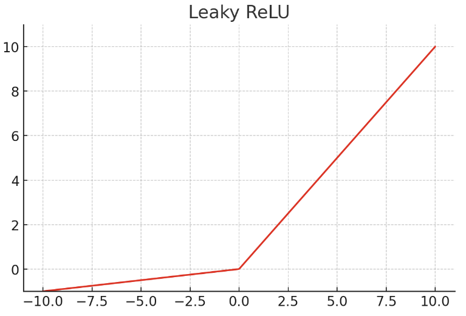

 

## Activation Function

은닉층(Hidden Layer)과 출력층(Output Layer)의 뉴런에서 출력값을 결정하는 함수

비선형 함수(Nonlinear function)여야 함

 

## Step

> 
 $$ H(x) = \begin{cases} 0 & \text{if } x < 0 \\1 & \text{if } x \geq 0\end{cases} $$ 

  

 

## Hyperbolic Tangent

> 
 $$ \tanh(x) = \frac{e^x - e^{-x}}{e^x + e^{-x}} $$ 

  

 

## Sigmoid

> 
 $$ \sigma(x) = \frac{1}{1 + e^{-x}} $$ 

  

 

## Softmax

> 
 $$ \text{softmax}(x_i) = \frac{e^{x_i}}{\sum_{j} e^{x_j}} = \frac{e^{x_i - \max(x)}}{\sum_{j} e^{x_j - \max(x)}} $$ 

  

 
 
## ReLU (Rectified Linear Unit)

> 
 $$ \text{ReLU}(x) = \max(0, x) $$ 

  

 

## Leaky ReLU (Leaky Rectified Linear Unit)

> 
 $$ \text{Leaky ReLU}(x) = \begin{cases}       x & x > 0 \\      0.01x & x \leq 0    \end{cases} $$ 

  

 
 
 

[출처: 사이토 고키, 「밑바닥부터 시작하는 딥러닝 - 파이썬으로 익히는 딥러닝 이론과 구현, 한빛미디어](https://www.hanbit.co.kr/store/books/look.php?p_code=B8475831198)

[출처: 유원준, 상준, 「딥 러닝을 이용한 자연어 처리 입문, 위키독스](https://wikidocs.net/24987)

 
