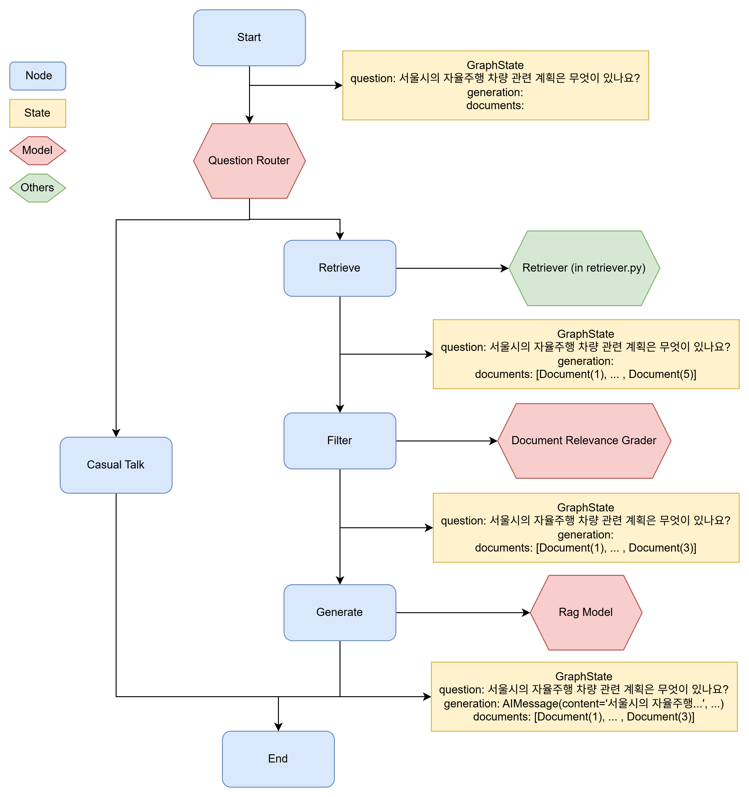

<br />

## 설치

```python
pip install langchain langchain_community langchain_chroma langchain_openai
pip install langchain
pip install langgraph
pip install python-dotenv
```

<br />

## 워크플로우

```python
[사용자 질문]
      │
      ▼
[라우팅] → casual_talk ─────→ [LLM 응답]
      │
      └──→ document_search → [vectorstore 검색]
                                   │
                                   ▼
                            [문서 관련성 필터링]
                                   │
                                   ▼
                            [LLM 답변 생성]
```



<br />

## 코드

```python
# gpt.py
from langchain_openai import ChatOpenAI
from langchain_core.prompts import ChatPromptTemplate
from langchain_core.prompts import PromptTemplate

from langgraph.graph import START, StateGraph, END

from typing import Literal
from pydantic import BaseModel, Field
from retriever import retriever
from dotenv import load_dotenv

from typing import List
from typing_extensions import TypedDict

############################################################
# Step 1. Define Routing Model
############################################################

# Load API key and init model
env_path = "api_key.env"
load_dotenv(dotenv_path=env_path)
model = ChatOpenAI(model="gpt-4o-mini")

# Routing schema: 'document_search' or 'casual_talk'
class RouteQuery(BaseModel):
    datasource: Literal["vectorstore", "document_search"] = Field(
        ...,
        description="""
        사용자 질문에 따라 casual_talk 또는 document_search로 라우팅합니다.
        - casual_talk: 일상 대화를 위한 데이터 소스. 사용자가 일상적인 질문을 할 때 사용합니다.
        - document_search: 사용자 질문에 답하기 위해 RAG로 vectorstore 검색이 필요한 경우 사용합니다.
        """,
    )

# Model with structured output for routing
structured_router_model = model.with_structured_output(RouteQuery)

# Routing instructions for the model
router_system_message  = """
당신은 사용자의 질문을 document_search 또는 casual_talk으로 라우팅하는 전문가입니다.
- document_search에는 서울, 뉴욕의 발전계획과 관련된 문서가 포함되어 있습니다. 이 주제에 대한 질문에는 document_search를 사용하십시오.
- 사용자의 질문이 일상 대화에 관련된 경우 casual_talk을 사용하십시오.
"""

# Prompt template with system and user messages
routing_prompt = ChatPromptTemplate.from_messages([
    ("system", router_system_message),
    ("human", "{question}"),
])

# Router pipeline: prompt + structured model
question_router = routing_prompt | structured_router_model

############################################################
# Step 2. Define Document Relevance Evaluation Model
############################################################

# Model for yes/no relevance evaluation of documents
class DocumentRelevance(BaseModel):
    relevance_score: Literal["yes", "no"] = Field(
        description="문서가 질문과 관련이 있는지 여부를 'yes' 또는 'no'로 평가합니다."
    )

# Structured output model for relevance scoring
structured_relevance_model = model.with_structured_output(DocumentRelevance)

# Prompt template to judge document relevance
relevance_prompt = PromptTemplate.from_template("""
당신은 검색된 문서가 사용자 질문과 관련이 있는지 평가하는 평가자입니다. \n
문서에 사용자 질문과 관련된 키워드 또는 의미가 포함되어 있으면, 해당 문서를 관련성이 있다고 평가하십시오. \n
엄격한 테스트가 필요하지 않습니다. 목표는 잘못된 검색 결과를 걸러내는 것입니다. \n
문서가 질문과 관련이 있는지 여부를 나타내기 위해 'yes' 또는 'no'로 이진 점수를 부여하십시오.

Retrieved document: \n {document} \n\n
User question: {question}
""")

# Grader combining prompt and model
document_relevance_grader = relevance_prompt | structured_relevance_model

############################################################
# Step 3. Define RAG Answer Generation Model
############################################################

# Prompt template to generate answers based on retrieved context
rag_prompt = PromptTemplate.from_template("""
너는 사용자의 질문에 대해 주어진 documents에 기반하여 답변하는 도시 계획 전문가이다.
주어진 documents는 vectorstore에서 검색된 결과이다.
주어진 documents를 기반으로 사용자의 question에 대해 답변하라.

=================================
question: {question}
documents: {documents}
"""
)

# Answer generator combining prompt and model
rag_model = rag_prompt | model

############################################################
# Step 4. Define Nodes & State
############################################################

# Define State
class GraphState(TypedDict):
    question: str # User's question
    generation: str # LLM generated response
    documents: List[str] # Retrieved documents

# Define Router
def route_question(state):
    """
    Routes the user's question to either the document_search or casual_chat

    Args:
        state (dict): Current graph state

    Returns:
        state (dict): New graph state with the routed data source and user question
    """

    print('[Routing] Starting to determine the best data source...')

    question = state['question']
    route = question_router.invoke({"question": question})

    print(f"[Routing] Routing decision made: {route.datasource}.")

    return route.datasource

# Define 'retrieve' Node
def retrieve_documents(state):
    """
    Searches documents relevant to the question in the vectorstore.

    Args:
        state (dict): Current graph state

    return:
        state (dict): New graph state containing retrieved documents and the user question
    """

    print("[Retrieve] Searching documents in vectorstore...")

    question = state['question']
    documents = retriever.invoke(question)

    print(f"[Retrieve] Found {len(documents)} documents.")

    return {"documents": documents, "question": question}

# Define 'filter' Node
def filter_relevant_documents(state):
    """
    Evaluates retrieved documents for relevance to the question

    Args:
        state (dict): Current graph state

    return:
        state (dict): New graph state containing only relevant documents and the user question
    """

    print("[Filter] Evaluating document relevance...")

    question = state['question']
    documents = state['documents']
    filtered_docs = []

    for i, doc in enumerate(documents):
        is_relevant = document_relevance_grader.invoke({"question": question, "document": doc.page_content})
        if is_relevant.relevance_score == "yes":
            filtered_docs.append(doc)

    print(f"[Filter] {len(filtered_docs)} of {len(documents)} documents are relevant.")

    return {"documents": filtered_docs, "question": question}

# Define 'generate' Node
def generate_answer_from_documents(state):
    """
    Generates an answer using an LLM based on the provided documents and user question

    Args:
        state (dict): Current graph state

    return:
        state (dict): New graph state containing the original documents, question, and the generated answer
    """
    print("[Generate] Starting answer generation using LLM...")

    question = state['question']
    documents = state['documents']
    generation = rag_model.invoke({"question": question, "documents": documents})

    print("[Generate] Answer generation completed.")

    return {
        "documents": documents,
        "question": question,
        "generation": generation
    }

# Define 'casual_talk' Node
def generate_casual_response(state):
    """
    Generates a response for casual or general conversation

    Args:
        state (dict): Current graph state

    return:
        state (dict): New graph state containing the user question and the generated casual response
    """

    print("[Casual Talk] Starting casual response generation...")

    question = state['question']
    generation = model.invoke(question)

    print("[Casual Talk] Casual response generation completed")

    return {
        "question": question,
        "generation": generation
    }

############################################################
# Step 5. Build the LangGraph
############################################################

# Create the LangGraph workflow
workflow = StateGraph(GraphState)

# Add nodes
workflow.add_node("retrieve", retrieve_documents)
workflow.add_node("filter", filter_relevant_documents)
workflow.add_node("generate", generate_answer_from_documents)
workflow.add_node("casual_talk", generate_casual_response)

# Add edges
workflow.add_conditional_edges(
    START,
    route_question,
    {
        "document_search": "retrieve",
        "casual_talk": "casual_talk"
    }
)
workflow.add_edge("casual_talk", END)
workflow.add_edge("retrieve", "filter")
workflow.add_edge("filter", "generate")
workflow.add_edge("generate", END)

# Compile the final graph
app = workflow.compile()

############################################################
# Step 6. Run the Graph
############################################################

inputs = {
    "question": "서울시의 자율주행 차량 관련 계획은 무엇이 있나요?"
}

for msg, meta in app.stream(inputs, stream_mode='messages'):
    print(msg.content, end='')
```

```python
# retriever.py
from langchain_community.document_loaders import PyPDFLoader
from langchain_text_splitters import RecursiveCharacterTextSplitter
from langchain_openai import OpenAIEmbeddings
from langchain_chroma import Chroma

from glob import glob
import os
from dotenv import load_dotenv

# Read and split PDF
def read_pdf_and_split_text(pdf_path, chunk_size=1000, chunk_overlap=100):
    """
    Reads the given PDF file and splits its text into chunks

    Parameters:
        pdf_path (str): Path to the PDF file.
        chunk_size (int, optional): The size of each text chunk (default: 1000)
        chunk_overlap (int, optional): The number of overlapping characters between chunks (default: 100)

    Returns:
        list: A list of text chunks extracted from the PDF
    """
    print(f"Loading and splitting PDF: {pdf_path}")

    # Load PDF
    pdf_loader = PyPDFLoader(pdf_path)
    data_from_pdf = pdf_loader.load()

    # Split text into chunks
    text_splitter = RecursiveCharacterTextSplitter(
        chunk_size=chunk_size, chunk_overlap=chunk_overlap
    )
    splits = text_splitter.split_documents(data_from_pdf)

    print(f"Text split completed ({len(splits)} chunks created)\n")

    return splits

# Load API key and initialize embedding model
env_path = "api_key.env"
load_dotenv(dotenv_path=env_path)
OPENAI_API_KEY = os.getenv('OPENAI_API_KEY')
embedding = OpenAIEmbeddings(model='text-embedding-3-large', api_key=OPENAI_API_KEY)

# Directory to persist Chroma vectorstore
persist_directory='./chroma_store'

# Load or build vectorstore
if os.path.exists(persist_directory):

    print("Loading existing Chroma store")

    vectorstore = Chroma(
        persist_directory=persist_directory,
        embedding_function=embedding
    )
else:

    print("Creating new Chroma store")

    vectorstore = None
    for g in glob('./data/docs/*.pdf'):
        chunks = read_pdf_and_split_text(g)

        for i in range(0, len(chunks), 100):
            if vectorstore is None:
                vectorstore = Chroma.from_documents(
                    documents=chunks[i:i+100],
                    embedding=embedding,
                    persist_directory=persist_directory
                )
            else:
                vectorstore.add_documents(
                    documents=chunks[i:i+100]
                )

# Export retriever
retriever = vectorstore.as_retriever(search_kwargs={"k": 5})
```

<br />
<br />
<br />

[출처: 이성용, 「Do it! LLM을 활용한 AI 에이전트 개발 입문 - GPT API+딥시크+라마+랭체인+랭그래프+RAG」, 이지스퍼블리싱](https://www.easyspub.co.kr/20_Menu/BookView/764/PUB)

<br />
