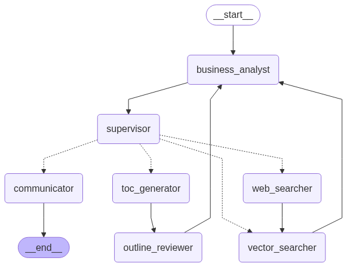

<br />

## 구조



<details>
    <summary>Business Analyst</summary>

사용자 요구와 AI 추천을 분석하여 목표(goal)와 작업 방법(method)을 도출


</details>

<details>
    <summary>Supervisor</summary>

현재 상황을 판단해 다음에 실행할 agent를 선택하고 작업을 할당


</details>

<details>
    <summary>Web Searcher</summary>

부족한 정보를 보완하기 위해 웹 검색을 수행하고 그 결과를 벡터 DB에 반영


</details>

<details>
    <summary>Vector Searcher</summary>

필요한 정보를 벡터 검색을 통해 수집하고, 참고자료로 정리


</details>

<details>
    <summary>TOC Generator</summary>

사용자 요구와 참고 자료를 바탕으로 책의 전체 목차(TOC)를 생성하거나 수정


</details>

<details>
    <summary>Outline Reviewer</summary>

생성된 목차를 검토하고 논리적 흐름, 참고자료 활용 여부 등을 평가한 뒤 피드백을 제공


</details>

<details>
    <summary>Communicator</summary>

사용자에게 현재까지의 진행 상황을 공유하고, 추가 피드백이나 지시를 요청


</details>

<br />

## 코드

<details>
    <summary>main.py</summary>

```python
from langgraph.graph import StateGraph, START, END
from langchain_core.messages import SystemMessage, HumanMessage

from datetime import datetime
from agents import State, business_analyst, outline_reviewer, communicator, toc_generator, supervisor, vector_searcher, web_searcher
from utils import save_state
import os


# Get current file, path, and directory
absolute_path = os.path.abspath(__file__) # e.g., "/home/user/project/agent.py"
current_path = os.path.dirname(absolute_path) # e.g., "/home/user/project"

# Create the LangGraph workflow
graph_builder = StateGraph(State)

# Add routers
def supervisor_router(state: State):
    task = state['task_history'][-1]
    return task.agent

# Add nodes
graph_builder.add_node("business_analyst", business_analyst)
graph_builder.add_node("supervisor", supervisor)
graph_builder.add_node("communicator", communicator)
graph_builder.add_node("toc_generator", toc_generator)
graph_builder.add_node("outline_reviewer", outline_reviewer)
graph_builder.add_node("web_searcher", web_searcher)
graph_builder.add_node("vector_searcher", vector_searcher)

# Add edges
graph_builder.add_edge(START, "business_analyst")
graph_builder.add_edge("business_analyst", "supervisor")
graph_builder.add_conditional_edges(
    "supervisor",
    supervisor_router,
    {
        "toc_generator": "toc_generator",
        "communicator": "communicator",
        "vector_searcher":"vector_searcher",
        "web_searcher": "web_searcher"
    }
)
graph_builder.add_edge("toc_generator", "outline_reviewer")
graph_builder.add_edge("outline_reviewer", "business_analyst")
graph_builder.add_edge("web_searcher", "vector_searcher")
graph_builder.add_edge("vector_searcher", "business_analyst")
graph_builder.add_edge("communicator", END)

# Compile the final graph
graph = graph_builder.compile()

# Initialize state
state = State(
    messages = [
        SystemMessage(
                f"""
            너희 AI들은 사용자의 요구에 맞는 책을 쓰는 작가팀이다.
            사용자가 사용하는 언어로 대화하라.

            현재시각은 {datetime.now().strftime('%Y-%m-%d %H:%M:%S')}이다.

            """
        )
    ],
    task_history = [],
    references = {"queries": [], "docs": []},
    user_request = ""
)

# Main interactive loop — keeps running until user quits
while True:
    user_input = input("\nUser\t: ").strip()

    if user_input.lower() in ['exit', 'quit', 'q']:
        print("Goodbye!")
        break

    state["messages"].append(HumanMessage(user_input))
    state = graph.invoke(state)

    save_state(current_path, state)
```

</details>

<details>
    <summary>agents.py</summary>

```python
from langchain_core.messages import AnyMessage, AIMessage, HumanMessage
from langchain_core.output_parsers.string import StrOutputParser
from langchain_core.prompts import PromptTemplate
from langchain_openai import ChatOpenAI

from dotenv import load_dotenv
from typing_extensions import TypedDict
from typing import List
import os
from datetime import datetime

from utils import get_outline, save_outline, save_state
from models import Task
from tools import retrieve, web_search, import_web_pages_to_chroma


# Get current file path, and directory
absolute_path = os.path.abspath(__file__) # e.g., "/home/user/project/agent.py"
current_path = os.path.dirname(absolute_path) # e.g., "/home/user/project"


# Load API key and init model
env_path = "api_key.env"
load_dotenv(dotenv_path=env_path)
model = ChatOpenAI(model="gpt-4o")


# Define State
class State(TypedDict):
    messages: List[AnyMessage | str]
    task_history: List[Task]
    references: dict
    user_request: str
    ai_recommendation: str
    supervisor_call_count: int


###########################################################
# Business Analyst
###########################################################
def business_analyst(state: State):

    """Analyze user needs and return goal with method."""
    print("\n============ [Business Analyst] ============\n")

    # Define prompt for business analyst role
    system_prompt = PromptTemplate.from_template(
        """
        너는 책을 쓰는 AI팀의 business analyst로서,
        AI팀의 진행상황과 사용자 요구사항을 토대로,
        현 시점에서 AI 추천(ai_recommendation)과 사용자 최근 발언(user_last_comment)을 바탕으로 요구사항이 무엇인지 판단한다.
        지난 요청사항이 달성되었는지 판단하고, 현 시점에서 어떤 작업을 해야 하는지 결정한다.

        다음과 같은 템플릿 형태로 반환한다.
        - 목표: OOOO \n 방법: OOOO

        ------------------------------------
        AI 추천 (ai_recommendation): {ai_recommendation}
        ------------------------------------
        사용자 최근 발언 (user_last_comment): {user_last_comment}
        ------------------------------------
        참고자료 (references): {references}
        ------------------------------------
        목차 (outline): {outline}
        ------------------------------------
        이전 대화 내용 (messages): {messages}
        """
    )

    # Create business analyst chain
    business_analyst = system_prompt | model | StrOutputParser()

    # Get inputs
    ai_recommendation = state.get("ai_recommendation", None)
    references = state.get("references", {"queries": [], "docs": []})
    outline = get_outline(current_path)
    messages = state.get("messages", [])

    user_last_comment = None
    for m in messages[::-1]:
        if isinstance(m, HumanMessage):
            user_last_comment = m.content
            break

    inputs = {
        "ai_recommendation": ai_recommendation,
        "references": references,
        "outline": outline,
        "messages": messages,
        "user_last_comment": user_last_comment
    }

    # Invoke model to analyze user requirements
    user_request = business_analyst.invoke(inputs)

    # Append business analyst's task message
    messages.append(AIMessage(f"[Business Analyst] {user_request}"))
    print(user_request)

    # Save current state
    save_state(current_path, state)

    print("\n============ [Business Analyst Completed] ============\n")

    return {
        "messages": messages,
        "user_request": user_request,
        "ai_recommendation": ""
    }


###########################################################
# Supervisor
###########################################################
def supervisor(state: State):

    """Determine next task based on state and update messages."""
    print("\n============ [Supervisor] ============\n")

    # Define prompt for supervisor role
    system_prompt = PromptTemplate.from_template(
        """
        너는 AI 팀의 supervisor로서 AI 팀의 작업을 관리하고 지도한다.
        사용자가 원하는 책을 써야 한다는 최종 목표를 염두에 두고,
        사용자의 요구를 달성하기 위해 현재 해야할 일이 무엇인지 결정한다.

        supervisor가 활용할 수 있는 agent는 다음과 같다.
        - toc_generator: 사용자의 요구사항이 명확해졌을 때 사용한다. AI 팀의 콘텐츠 전략을 결정하고, 전체 책의 목차(outline)를 작성한다.
        - communicator: AI 팀에서 해야 할 일을 스스로 판단할 수 없을 때 사용한다. 사용자에게 진행상황을 사용자에게 보고하고, 다음 지시를 물어본다.
        - web_searcher: vector_searcher를 시도하고, 검색 결과(references)에 필요한 정보가 부족한 경우 사용한다. 웹 검색을 통해 해당 정보를 vector DB에 보강한다.
        - vector_searcher: vector DB 검색을 통해 목차(outline) 작성에 필요한 정보를 확보한다.

        아래 내용을 고려하여, 현재 해야할 일이 무엇인지, 사용할 수 있는 agent를 단답으로 말하라.

        ------------------------------------------
        기존 목차 (previous_outline): {outline}
        ------------------------------------------
        이전 대화 내용 (messages): {messages}
        """
    )

    # Create supervisor chain
    supervisor = system_prompt | model.with_structured_output(Task)

    # Get inputs
    messages = state.get("messages", [])

    inputs = {
        "messages": messages,
        "outline": get_outline(current_path)
    }

    # Check supervisor call count
    supervisor_call_count = state.get("supervisor_call_count", 0)

    # If over limit, assign communicator task
    if supervisor_call_count > 2:
        task = Task(
            agent="communicator",
            done=False,
            description="supervisor 호출 횟수 초과했으므로, 현재까지의 진행상황을 사용자에게 보고한다. ",
            done_at="",
        )
    # Otherwise, invoke model to determine next task
    else:
        task = supervisor.invoke(inputs)

    # Update task history
    task_history = state.get("task_history", [])
    task_history.append(task)

    # Append supervisor's task message
    messages.append(AIMessage(f"[Supervisor] {task}"))
    print(task.agent)

    print("\n============ [Supervisor Completed] ============\n")

    return {
        "messages": messages,
        "task_history": task_history,
        "supervisor_call_count": supervisor_call_count + 1
    }


###########################################################
# TOC Generator
###########################################################
def toc_generator(state: State):

    """Generates a table of contents based on the input state."""
    print("\n============ [TOC Generator] ============\n")

    # Get task history from state
    task_history = state.get("task_history", [])

    # Confirm toc_generator
    if task_history[-1].agent != "toc_generator":
        raise ValueError(
            f"Invalid agent: Only 'toc_generator' is allowed to generate the table of contents.\n"
            f"Current task: {task_history[-1]}"
        )

    # Define prompt for TOC generator role
    system_prompt = PromptTemplate.from_template(
        """
        너는 책을 쓰는 AI팀의 콘텐츠 전략가로서,
        이전 대화 내용을 바탕으로 사용자의 요구사항을 분석하고, AI팀이 쓸 책의 세부 목차를 결정한다.

        지난 목차가 있다면 그 버전을 사용자의 요구에 맞게 수정하고, 없다면 새로운 목차를 제안한다.
        목차를 작성하는데 필요한 정보는 참고 자료(references)에 있으므로 활용한다.

        다음 정보를 활용하여 목차를 작성하라.
        - 사용자 요구사항 (user_request)
        - 작업 (task)
        - 검색 자료 (references)
        - 기존 목차 (previous_outline)
        - 이전 대화 내용 (messages)

        너의 작업 목표는 다음과 같다:
        1. 만약 기존 목차(previous_outline)가 존재한다면, 사용자의 요구사항을 토대로 기존 목차에서 어떤 부분을 수정하거나 추가할지 결정한다.
        - 이번 목차 작성의 주안점에 사용자 요구사항(user_request)을 충족시키는 것을 명시해야 한다.
        2. 책의 전반적인 구조(chapter, section)를 설계하고, 각 chpater와 section의 제목을 정한다.
        3. 책의 전반적인 세부구조(chapter, section, sub-section)를 설계하고, sub-section 하부의 주요 내용을 리스트 형태로 정리한다.
        4. 목차의 논리적인 흐름이 사용자 요구를 충족시키는지 확인한다.
        5. 참고자료(references)를 적극 활용하여 근거에 기반한 목차를 작성한다.
        6. 참고문헌은 반드시 참고자료(references)를 근거로 작성해야 하며, 최대한 풍부하게 준비한다. URL은 전체 주소를 적어야 한다.
        7. 추가 자료나 리서치가 필요한 부분을 파악하여 supervisor에게 요청한다.

        사용자 요구사항(user_request)을 최우선으로 반영하는 목차로 만들어야 한다.

        --------------------------------
        사용자 요구사항 (user_request): {user_request}
        --------------------------------
        작업 (task): {task}
        --------------------------------
        참고 자료 (references): {references}
        --------------------------------
        기존 목차 (previous_outline): {outline}
        --------------------------------
        이전 대화 내용 (messages): {messages}
        --------------------------------

        작성 형식 아래 양식을 지키되 하부 항목으로 더 세분화해도 좋다. 목차(outline) 양식의 챕터, 섹션 등 항목의 갯수는 필요한만큼 추가하라.
        섹션 갯수는 최소 2개 이상이어야 하며, 더 많으면 좋다.

        outline_template은 예시로 앞부분만 제시한 것이다. 각 장은 ':---CHAPTER DIVIDER---:'로 구분한다.
        목차 양식 (outline_template): {outline_template}

        사용자가 추가 피드백을 제공할 수 있도록 논리적인 흐름과 주요 목차 아이디어를 제안하라.
        """
    )

    # Create TOC generator chain
    toc_generator = system_prompt | model | StrOutputParser()

    # Get inputs
    user_request = state.get("user_request", "")
    task = task_history[-1]
    messages = state.get("messages", [])
    outline = get_outline(current_path)
    references = state.get("references", {"queries": [], "docs": []})

    outline_template = None
    with open(f"{current_path}/data/outline_template.md", "r", encoding='utf-8') as f:
        outline_template = f.read()

    inputs = {
        "user_request": user_request,
        "task": task,
        "messages": messages,
        "outline": outline,
        "references": references,
        "outline_template": outline_template
    }

    # Stream and collect generated TOC
    gathered = ''
    for chunk in toc_generator.stream(inputs):
        gathered += chunk
        print(chunk, end='')
    print()

    # Save TOC
    save_outline(current_path, gathered)

    # Find review
    review = None
    if '-----: DONE :-----' in gathered:
        review = gathered.split('-----: DONE :-----')[1]
    else:
        review = gathered[-200:]

    # Append toc generator's task message
    messages.append(AIMessage("[TOC Generator] {review}"))

    # Mark the last task as completed
    task_history[-1].done = True
    task_history[-1].done_at = datetime.now().strftime('%Y-%m-%d %H:%M:%S')

    print("\n============ [TOC Generator Completed] ============\n")

    return {
        "messages": messages,
        "task_history": task_history
    }


###########################################################
# Outline Reviewer
###########################################################
def outline_reviewer(state: State):

    """Reviews outline and provides feedback."""
    print("\n============ [Outline Reviewer] ============\n")

    # Define prompt for outline reviewer role
    system_prompt = PromptTemplate.from_template(
        """
        너는 AI팀의 목차 리뷰어로서, AI팀이 작성한 목차(outline)를 검토하고 문제점을 지적한다.

        - 목차(outline)가 사용자의 요구사항을 충족시키는지 여부
        - 목차(outline)의 논리적인 흐름이 적절한지 여부
        - 근거에 기반하지 않은 내용이 있는지 여부
        - 주어진 참고자료(references)를 충분히 활용했는지 여부
        - 참고자료(references)가 충분한지, 혹은 잘못된 참고자료(references)가 있는지 여부
        - example.com 같은 더미 URL이 있는지 여부
        - 실제 페이지 URL이 아닌 대표 URL로 되어 있는 경우 삭제 해야함: 어떤 URL이 삭제되어야 하는지 명시하라.
        - 기타 리뷰 사항

        그 분석 결과를 설명하고, 다음 어떤 작업을 하면 좋을지 제안하라.

        - 분석결과: outline이 사용자의 요구사항을 충족시키는지 여부
        - 제안사항: vector_searcher, communicator 중 어떤 agent를 호출할지

        ------------------------------------------
        사용자 요구사항 (user_request): {user_request}
        ------------------------------------------
        참고 자료 (references): {references}
        ------------------------------------------
        목차 (outline): {outline}
        ------------------------------------------
        이전 대화 내용 (messages): {messages}
        """
    )

    # Create outline reviewer chain
    outline_reviewer = system_prompt | model

    # Get inputs
    user_request = state.get("user_request", None)
    outline = get_outline(current_path)
    references = state.get("references", {"queries": [], "docs": []})
    messages = state.get("messages", [])

    inputs = {
        "user_request": user_request,
        "outline": outline,
        "references": references,
        "messages": messages
    }

    # Stream and collect outline review
    review = outline_reviewer.stream(inputs)
    gathered = None

    for chunk in review:
        print(chunk.content, end='')

        if gathered is None:
            gathered = chunk
        else:
            gathered += chunk

    # Append outline reviewer's task message
    messages.append(AIMessage(f"[Outline Reviewer] {gathered}"))

    # Extract AI recommendation from content
    ai_recommendation = gathered.content

    print("\n============ [Outline Reviewer Completed] ============\n")

    return {
        "messages": messages,
        "ai_recommendation": ai_recommendation
    }


###########################################################
# Web Searcher
###########################################################
def web_searcher(state: State):

    """Finds information through web search based on previous agent tasks."""
    print("\n============ [Web Search Agent] ============\n")

    # Get task history from state
    task_history = state.get("task_history", [])

    # Confirm web_searcher
    if task_history[-1].agent != "web_searcher":
        raise ValueError(
            f"Invalid agent: Only 'web_searcher' is allowed to perform web-based search.\n"
            f"Current task: {task_history[-1]}"
        )

    # Define prompt for web searcher role
    system_prompt = PromptTemplate.from_template(
        """
        너는 다른 AI Agent 들이 수행한 작업을 바탕으로,
        목차(outline) 작성에 필요한 정보를 웹 검색을 통해 찾아내는 Web Search Agent이다.

        현재 부족한 정보를 검색하고, 복합적인 질문은 나눠서 검색하라.

        --------------------------------
        검색 목적 (mission): {mission}
        --------------------------------
        과거 검색 내용 (references): {references}
        --------------------------------
        이전 대화 내용 (messages): {messages}
        --------------------------------
        목차 (outline): {outline}
        --------------------------------
        현재 시각 (current_time): {current_time}
        """
    )

    # Create web searcher chain
    model_with_web_search = model.bind_tools([web_search])
    web_searcher = system_prompt | model_with_web_search

    # Get inputs
    mission = task_history[-1].description
    references = state.get("references", {"queries": [], "docs": []})
    messages = state.get("messages", [])
    outline = get_outline(current_path)
    current_time = datetime.now().strftime('%Y-%m-%d %H:%M:%S')

    inputs = {
        "mission": mission,
        "references": references,
        "messages": messages,
        "outline": outline,
        "current_time": current_time
    }

    # Invoke model to perform web search
    search_plans = web_searcher.invoke(inputs)
    queries = []

    for tool_call in search_plans.tool_calls:
        args = tool_call["args"]
        queries.append(args["query"])
        results, json_path = web_search.invoke(args)
        for result in results:
            print(f"URL\t: {result["url"]}")
            print(f"Title\t: {result["title"]}\n")
        import_web_pages_to_chroma(json_path)

    # Append web searcher's task message
    messages.append(AIMessage(f"[Web Searcher] {queries}"))

    # Mark the last task as completed
    task_history[-1].done = True
    task_history[-1].done_at = datetime.now().strftime('%Y-%m-%d %H:%M:%S')

    # Add new task for vector searcher agent
    task_desc = "AI팀이 쓸 책의 세부 목차를 결정하기 위한 정보를 벡터 검색을 통해 찾아낸다."
    task_desc += f" 다음 항목이 새로 추가되었다\n: {queries}"

    new_task = Task(
        agent="vector_searcher",
        done=False,
        description=task_desc,
        done_at=""
    )
    task_history.append(new_task)

    print("\n============ [Web Searcher Completed] ============\n")

    return {
        "messages": messages,
        "task_history": task_history
    }


###########################################################
# Vector Searcher
###########################################################
def vector_searcher(state: State):

    """Performs vector-based document retrieval."""
    print("\n============ [Vector Searcher] ============\n")

    # Get task history from state
    task_history = state.get("task_history", [])

    # Confirm vector_searcher
    if task_history[-1].agent != "vector_searcher":
        raise ValueError(
            f"Invalid agent: Only 'vector_searcher' is allowed to perform vector-based search.\n"
            f"Current task: {task_history[-1]}"
        )

    # Define prompt for vector searcher role
    system_prompt = PromptTemplate.from_template(
        """
        너는 다른 AI Agent 들이 수행한 작업을 바탕으로,
        목차(outline) 작성에 필요한 정보를 벡터 검색을 통해 찾아내는 Agent이다.

        현재 목차(outline)을 작성하는데 필요한 정보를 확보하기 위해,
        다음 내용을 활용해 적절한 벡터 검색을 수행하라.

        --------------------------------
        검색 목적 (mission): {mission}
        --------------------------------
        과거 검색 내용 (referemces): {references}
        --------------------------------
        이전 대화 내용 (messages): {messages}
        --------------------------------
        목차 (outline): {outline}
        """
    )

    # Create vector searcher chain
    model_with_retriever = model.bind_tools([retrieve])
    vector_searcher = system_prompt | model_with_retriever

    # Get inputs
    mission = task_history[-1].description
    references = state.get("references", {"queries": [], "docs": []})
    messages = state.get("messages", [])
    outline = get_outline(current_path)

    inputs = {
        "mission": mission,
        "references": references,
        "messages": messages,
        "outline": outline
    }

    # Invoke model to perform vector search
    search_plans = vector_searcher.invoke(inputs)

    for tool_call in search_plans.tool_calls:
        args = tool_call["args"]
        query = args["query"]
        retrieved_docs = retrieve.invoke(args)
        references["queries"].append(query)
        references["docs"] += retrieved_docs

    # Remove duplicate documents
    unique_docs = []
    unique_page_contents = set()

    for doc in references["docs"]:
        if doc.page_content not in unique_page_contents:
            unique_docs.append(doc)
            unique_page_contents.add(doc.page_content)
    references["docs"] = unique_docs

    # Print search queries
    print('Queries\t:')
    queries = references["queries"]
    for query in queries:
        print(query)
    print()

    # Print search results
    for doc in references["docs"]:
        print('Reference\t:')
        print(doc.page_content[:100])
        print()

    # Append vector searcher's task message
    messages.append(AIMessage(f"[Vector Searcher] {queries}"))

    # Mark the last task as completed
    task_history[-1].done = True
    task_history[-1].done_at = datetime.now().strftime('%Y-%m-%d %H:%M:%S')

    # Assign AI recommendation
    ai_recommendation = "현재 참고자료(references)가 목차(outline)를 개선하는데 충분한지 확인하라. 충분하다면 toc_generator로 목차 작성을 하라. "

    print("\n============ [Vector Searcher Completed] ============\n")

    return {
        "messages": messages,
        "task_history": task_history,
        "references": references,
        "ai_recommendation": ai_recommendation
    }


###########################################################
# Communicator
###########################################################
def communicator(state: State):

    """Handle interaction between the AI team and user."""
    print("\n============ [Communicator] ============\n")

    # Get task history from state
    task_history = state.get("task_history", [])

    # Confirm communicator
    if task_history[-1].agent != "communicator":
        raise ValueError(
            "Invalid agent: Only 'communicator' is allowed to initiate conversation.\n"
            f"Current task: {task_history[-1]}"
        )

    # Define prompt for communicator role
    system_prompt = PromptTemplate.from_template(
        """
        너는 책을 쓰는 AI팀의 커뮤니케이터로서,
        AI팀의 진행상황을 사용자에게 보고하고, 사용자의 의견을 파악하기 위한 대화를 나눈다.

        사용자도 outline(목차)을 이미 보고 있으므로, 다시 출력할 필요는 없다.

        --------------------------------
        목차 (outline): {outline}
        --------------------------------
        이전 대화 내용 (messages): {messages}
        """
    )

    # Create communicator chain
    communicator = system_prompt | model

    # Get inputs
    messages = state["messages"]
    outline = get_outline(current_path)

    inputs = {
        "messages": messages,
        "outline": outline
    }

    # Stream and collect response
    gathered = None
    print('AI\t: ', end='')
    for chunk in communicator.stream(inputs):
        print(chunk.content, end='')
        if gathered is None:
            gathered = chunk
        else:
            gathered += chunk
    print()

    # Append communicator's task message
    messages.append(AIMessage(f"[Communicator] {gathered}"))

    # Mark the last task as completed
    task_history[-1].done = True
    task_history[-1].done_at = datetime.now().strftime('%Y-%m-%d %H:%M:%S')

    print("\n============ [Communicator Completed] ============\n")

    return {
        "messages": messages,
        "task_history": task_history,
        "supervisor_call_count": 0
    }
```

</details>

<details>
    <summary>models.py</summary>

```python
from pydantic import BaseModel, Field
from typing import Literal


class Task(BaseModel):
    agent: Literal[
        "toc_generator",
        "communicator",
        "web_searcher",
        "vector_searcher"
    ] = Field(
        ...,
        description="""
        작업을 수행하는 agent의 종류.
        - toc_generator: 콘텐츠 전략을 수립하는 작업을 수행한다. 사용자의 요구사항이 명확해졌을 때 사용한다. AI 팀의 콘텐츠 전략을 결정하고, 전체 책의 목차(outline)를 작성한다.
        - communicator: AI 팀에서 해야 할 일을 스스로 판단할 수 없을 때 사용한다. 사용자에게 진행상황을 사용자에게 보고하고, 다음 지시를 물어본다.
        - web_searcher: 웹 검색을 통해 목차(outline) 작성에 필요한 정보를 확보한다.
        - vector_searcher: 벡터 DB 검색을 통해 목차(outline) 작성에 필요한 정보를 확보한다.
        """
    )

    done: bool = Field(..., description="종료 여부")

    description: str = Field(..., description="어떤 작업을 해야 하는지에 대한 설명")

    done_at: str = Field(..., description="할 일이 완료된 날짜와 시간")

    def to_dict(self):
        return {
            "agent": self.agent,
            "done": self.done,
            "description": self.description,
            "done_at": self.done_at
        }
```

</details>

<details>
    <summary>tools.py</summary>

```python
from langchain_core.tools import tool
from langchain_community.document_loaders import WebBaseLoader
from langchain_core.documents import Document
from langchain_text_splitters import RecursiveCharacterTextSplitter
from langchain_openai import OpenAIEmbeddings
from langchain_chroma import Chroma

from datetime import datetime
import json
import os
from tavily import TavilyClient
from dotenv import load_dotenv


# Get current file path, and directory
absolute_path = os.path.abspath(__file__) # e.g., "/home/user/project/agent.py"
current_path = os.path.dirname(absolute_path) # e.g., "/home/user/project"

# Set up OpenAI embedding
env_path = "api_key.env"
load_dotenv(dotenv_path=env_path)
embedding = OpenAIEmbeddings(model='text-embedding-3-large')

# Set Chroma DB path
persist_directory = f"{current_path}/data/chroma_store"

# Create Chroma vector store
vectorstore = Chroma(
    persist_directory=persist_directory,
    embedding_function=embedding
)


@tool
def web_search(query: str):
    """
    Perform a web search for the given query and return the results.

    Args:
        query (str): Search keyword

    Returns:
        dict: Search results
    """

    # Perform web search and get results
    client = TavilyClient()
    content = client.search(
        query,
        search_depth="advanced",
        include_raw_content=True,
    )
    results = content["results"]

    # If raw_content is missing, attempt to load page
    for result in results:
        if result["raw_content"] is None:
            try:
                result["raw_content"] = load_web_page(result["url"])
            except Exception as e:
                print(f"Error loading page: {result['url']}")
                print(e)
                result["raw_content"] = result["content"]

    # Save search results to JSON file
    results_path = f'{current_path}/data/resources_{datetime.now().strftime('%Y_%m%d_%H%M%S')}.json'
    with open(results_path, 'w', encoding='utf-8') as f:
        json.dump(results, f, ensure_ascii=False, indent=4)

    return results, results_path


# Load web page text content
def load_web_page(url: str):

    # Load web page
    loader = WebBaseLoader(url, verify_ssl=False)

    # Extract main content
    content = loader.load()
    raw_content = content[0].page_content.strip()

    # Clean extra newlines and tabs
    while '\n\n\n' in raw_content or '\t\t\t' in raw_content:
        raw_content = raw_content.replace('\n\n\n', '\n\n')
        raw_content = raw_content.replace('\t\t\t', '\t\t')

    return raw_content


# Load web pages from JSON and save to Chroma DB
def import_web_pages_to_chroma(json_file, chunk_size=1000, chunk_overlap=100):

    documents = load_documents_from_json(json_file)
    save_documents_to_chroma(
        documents,
        chunk_size=chunk_size,
        chunk_overlap=chunk_overlap
    )


# Load Documents from a JSON file containing web pages
def load_documents_from_json(json_file):

    # Read JSON file
    with open(json_file, "r", encoding='utf-8') as f:
        resources = json.load(f)

    documents = []

    # Convert each web page to Document
    for web_page in resources:
        document = create_document_from_page(web_page)
        documents.append(document)

    return documents


# Create Document from web page data
def create_document_from_page(web_page):

    # Use longer content
    if len(web_page['raw_content']) > len(web_page['content']):
        page_content = web_page['raw_content']
    else:
        page_content = web_page['content']

    # Create Document with content and metadata
    document = Document(
        page_content=page_content,
        metadata={
            'title': web_page['title'],
            'source': web_page['url']
        }
    )

    return document


# Save new documents to Chroma DB
def save_documents_to_chroma (documents, chunk_size=1000, chunk_overlap=100):

    # Extract source URLs from incoming documents
    urls = [document.metadata['source'] for document in documents]

    # Get already stored metadata from Chroma
    stored_metadatas = vectorstore._collection.get()['metadatas']
    stored_urls = [metadata['source'] for metadata in stored_metadatas]

    # Identify new URLs that are not yet stored
    new_urls = set(urls) - set(stored_urls)

    # Filter documents with new URLs
    new_documents = []
    for document in documents:
        if document.metadata['source'] in new_urls:
            new_documents.append(document)

    # Split new documents into chunks
    splits = split_documents(new_documents, chunk_size=chunk_size, chunk_overlap=chunk_overlap)

    # Add to Chroma if there are any splits
    if splits:
        vectorstore.add_documents(splits)


# Split documents into smaller chunks
def split_documents(documents, chunk_size=1000, chunk_overlap=100):

    # Create text splitter
    text_splitter = RecursiveCharacterTextSplitter(
        chunk_size=chunk_size, chunk_overlap=chunk_overlap
    )

    # Split documents
    splits = text_splitter.split_documents(documents)

    return splits


@tool
def retrieve(query: str, top_k: int=5):
    """
    Retrieve top-k relevant documents from vectorstore based on query.

    Args:
        query (str): Search query string
        top_k (int): Number of top documents to retrieve (default 5)

    Returns:
        list: Retrieved documents
    """

    # Create retriever with top-k setting
    retriever = vectorstore.as_retriever(search_kwargs={"k": top_k})

    # Retrieve documents matching the query
    retrieved_docs = retriever.invoke(query)

    return retrieved_docs
```

</details>

<details>
    <summary>utils.py</summary>

```python
import os
import json


# Save state to JSON
def save_state(current_path, state):
    if not os.path.exists(f"{current_path}/data"):
        os.makedirs(f"{current_path}/data")

    state_dict = {}

    messages = [(m.__class__.__name__, m.content) for m in state["messages"]]
    state_dict["messages"] = messages

    with open(f"{current_path}/data/state.json", "w", encoding='utf-8') as f:
        json.dump(state_dict, f, indent=4, ensure_ascii=False)


# Read outline from file
def get_outline(current_path):
    outline = '아직 작성된 목차가 없습니다.'

    if os.path.exists(f"{current_path}/data/outline.md"):
        with open(f"{current_path}/data/outline.md", "r", encoding='utf-8') as f:
            outline = f.read()
    return outline


# Save outline to file
def save_outline(current_path, outline):
    if not os.path.exists(f"{current_path}/data"):
        os.makedirs(f"{current_path}/data")

    with open(f"{current_path}/data/outline.md", "w", encoding='utf-8') as f:
        f.write(outline)
    return outline
```

</details>

<details>
    <summary>outline_template.md</summary>

[outline_template.md](./Data/outline_template.md)

</details>

<br />
<br />
<br />

[출처: 이성용, 「Do it! LLM을 활용한 AI 에이전트 개발 입문 - GPT API+딥시크+라마+랭체인+랭그래프+RAG」, 이지스퍼블리싱](https://www.easyspub.co.kr/20_Menu/BookView/764/PUB)

<br />
