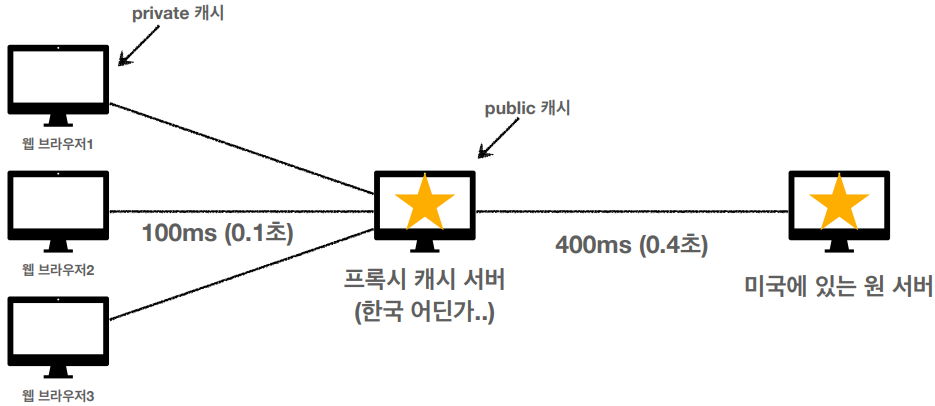
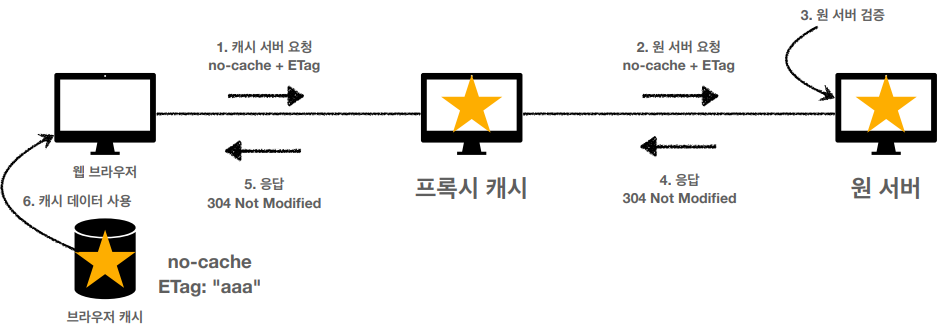
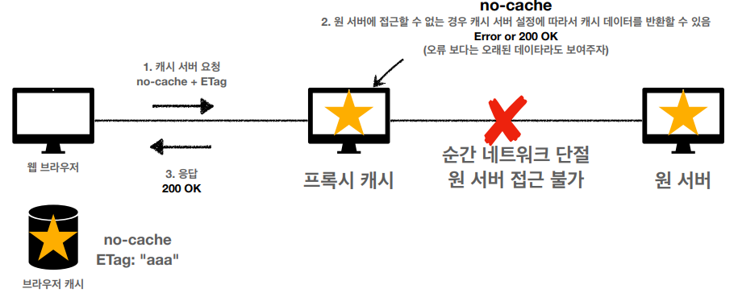
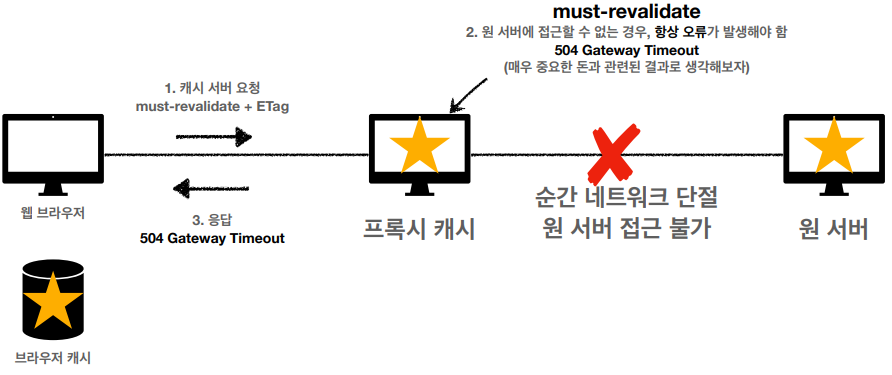

<br />

## Representation Header

<table>
    <thead>
        <tr>
            <th>표현 헤더</th>
            <th>설명</th>
            <th>예시</th>
        </tr>
    </thead>
    <tbody>
        <tr>
            <td>Content-Type</td>
            <td>미디어 타입, 문자 인코딩</td>
            <td>
                <p>text/html; charset=utf-8</p>
                <p>application/json</p>
                <p>image/png</p>
            </td>
        </tr>
        <tr>
            <td>Content-Encoding</td>
            <td>표현 데이터를 압축하기 위해 사용</td>
            <td>
                <p>gzip</p>
                <p>deflate</p>
                <p>identity</p>
            </td>
        </tr>
        <tr>
            <td>Content-Language</td>
            <td>표현 데이터의 자연 언어를 표현</td>
            <td>
                <p>ko</p>
                <p>en</p>
                <p>en-US</p>
            </td>
        </tr>
        <tr>
            <td>Content-Length</td>
            <td>바이트 단위</td>
            <td></td>
        </tr>
    </tbody>
</table>

- 요청, 응답 둘 다 사용

<p></p>

#### 전송방식

1. 단순전송

   - Content-Length 사용

   ```java
   HTTP/1.1 200 OK
   Content-Type: text/html;charset=UTF-8
   Content-Length: 3423

   <html>
   <body>...</body>
   </html>
   ```

2. 압축 전송

   - Content-Encoding 사용

   ```java
   HTTP/1.1 200 OK
   Content-Type: text/html;charset=UTF-8
   Content-Encoding: gzip
   Content-Length: 521

   lkj123kljoiasudlkjaweioluywlnfdo912u34ljko98udjkl
   ```

3. 분할 전송

   - Transfer-Encoding 사용

   ```java
   HTTP/1.1 200 OK
   Content-Type: text/plain
   Transfer-Encoding: chunked

   5
   Hello
   5
   World
   0
   \r\n
   ```

4. 범위 전송

   - Range, Content-Range
   - 요청할 때 (1001-2000 byte에 해당하는 message body만 요청)
     ```java
     GET /event
     Range: bytes=1001-2000
     ```
   - 응답할 때

     ```java
     HTTP/1.1 200 OK
     Content-Type: text/plain
     Content-Range: bytes 1001-2000 / 2000

     qweqwe1l2iu3019u2oehj1987askjh3q98y
     ```

<br />

## Content Negotiation Header

| 협상 헤더       | 설명                                   |
| --------------- | -------------------------------------- |
| Accept          | 클라이언트가 선호하는 미디어 타입 전달 |
| Accept-Charset  | 클라이언트가 선호하는 문자 인코딩      |
| Accept-Encoding | 클라이언트가 선호하는 압축 인코딩      |
| Accept-Language | 클라이언트가 선호하는 자연 언어        |

- 요청에만 사용
- Quality Values(q)을 사용하여 우선순위를 정할 수 있음 (0~1, 클수록 높은 우선순위)
  <p> ex. Accept-Language: ko-KR,ko;q=0.9,en-US;q=0.8,en;q=0.7 </p>
- 구체적인 것이 우선됨
  <p> ex. Accept: text/*, text/plain, text/plain;format=flowed, */* </p>

<br />

## General Information Header

<table>
    <thead>
        <tr>
            <th>일반 정보 헤더</th>
            <th>설명</th>
            <th>예시</th>
        </tr>
    </thead>
    <tbody>
        <tr>
            <td>From</td>
            <td>
                <p>유저 에이전트의 이메일 정보</p>
                <p>요청에서 사용</p>
            </td>
            <td></td>
        </tr>
        <tr>
            <td>Referer</td>
            <td>
                <p>이전 웹 페이지 주소</p>
                <p>요청에서 사용</p>
            </td>
            <td></td>
        </tr>
        <tr>
            <td>User-Agent</td>
            <td>
                <p>유저 에이전트 애플리케이션 정보</p>
                <p>요청에서 사용</p>
            </td>
            <td>
                <p>Mozilla/5.0 (Macintosh; Intel Mac OS X 10_15_7)</p>
                <p>AppleWebKit/537.36 (KHTML, like Gecko)</p>
                <p>Chrome/86.0.4240.183 Safari/537.36</p>
            </td>
        </tr>
        <tr>
            <td>Server</td>
            <td>
                <p>요청을 처리하는 ORIGIN 서버(proxy server, cache server가 아닌 http 응답을 해주는 서버)의 소프트웨어 정보</p>
                <p>응답에서 사용</p>
            </td>
            <td>
                <p>Apache/2.2.22 (Debian)</p>
                <p>nginx</p>
            </td>
        </tr>
        <tr>
            <td>Date</td>
            <td>
                <p>메시지가 발생한 날짜와 시간</p>
                <p>응답에서 사용</p>
            </td>
            <td><p>Tue, 15 Nov 1994 08:12:31 GMT</p></td>
        </tr>
    </tbody>
</table>

<br />

## Specialized Information Header

<table>
    <thead>
        <tr>
            <th>특별한 정보 헤더</th>
            <th>설명</th>
            <th>예시</th>
        </tr>
    </thead>
    <tbody>
        <tr>
            <td>Host</td>
            <td>
                <p>요청한 호스트 정보(도메인)</p>
                <p>요청에서 필수로 사용</p>
                <p>하나의 IP 주소에 여러 도메인이 적용되어 있을 때 사용</p>
            </td>
            <td><p>www.google.com</p></td>
        </tr>
        <tr>
            <td>Location</td>
            <td>
                <p>페이지 리다이렉션</p>
                <p>201 (Created) 응답에서 사용: Location 값은 요청에 의해 생성된 리소스 URI</p>
                <p>3xx (Redirection) 응답에서 사용: Location 값은 요청을 자동으로 리디렉션하기 위한 대상 리소스를 가리킴</p>
            </td>
            <td></td>
        </tr>
        <tr>
            <td>Allow</td>
            <td>
                <p>허용 가능한 HTTP 메서드</p>
                <p>405 (Method Not Allowed) 응답에서 사용</p>
            </td>
            <td><p>GET, HEAD, PUT</p></td>
        </tr>
        <tr>
            <td>Retry-After</td>
            <td>
                <p>유저 에이전트가 다음 요청을 하기까지 기다려야 하는 시간</p>
                <p>503 (Service Unavailable) 응답에서 사용: 서비스가 언제까지 불능인지 알려줄 수 있음</p>
            </td>
            <td><p>Fri, 31 Dec 1999 23:59:59 GMT</p></td>
        </tr>
    </tbody>
</table>

<br />

## Authorization Header

<table>
    <thead>
        <tr>
            <th>인증 헤더</th>
            <th>설명</th>
            <th>예시</th>
        </tr>
    </thead>
    <tbody>
        <tr>
            <td>Authorization</td>
            <td>
                <p>클라이언트 인증 정보를 서버에 전달 (요청)</p>
            </td>
            <td></td>
        </tr>
        <tr>
            <td>WWW-Authenticate</td>
            <td>
                <p>리소스 접근시 필요한 인증 방법 정의</p>
                <p>401 (Unauthorized) 응답에서 사용</p>
            </td>
            <td>
                <p>Newauth realm="apps", type=1, title="Login to \"apps\"", Basic realm="simple”</p>
            </td>
        </tr>
    </tbody>
</table>

<br />

## Cookie Header

| 쿠키 헤더  | 설명                                                                        | 예                                                                                                                           |
| ---------- | --------------------------------------------------------------------------- | ---------------------------------------------------------------------------------------------------------------------------- |
| Set-Cookie | 서버에서 클라이언트로 쿠키 전달 (응답)                                      | sessionId=abcde1234; expires=Sat, 26-Dec-2020 00:00:00 GMT; path=/; [domain=.google.com](http://domain=.google.com/); Secure |
| Cookie     | 클라이언트가 서버에서 받은 쿠키를 저장하고, HTTP 요청 시 서버로 전달 (요청) |                                                                                                                              |

<p></p>

**Expires**

- 만료일이 되면 쿠키 삭제
- 세션 쿠키: 만료 날짜를 생략하면 브라우저 종료시까지만 유지
- 영속 쿠키: 만료 날짜를 입력하면 해당 날짜까지 유지

<p></p>

**Max-age**

- timeout되면 쿠키 삭제
- 0이나 음수를 지정하면 쿠키 삭제

<p></p>

**Domain**

- 쿠키가 전송될 수 있는 도메인을 지정
- 명시한 문서 기준 도메인 + 서브 도메인 포함
- 생략하면 현재 문서 기준 도메인만 적용
- ex. domain=example.org일 경우 example.org, [dev.example.org](http://dev.example.org) 쿠키 접근 가능
- ex. example.org에서 쿠키를 생성하고 domain 지정을 생략할 경우, example.org 쿠키 접근 가능 dev.example.org 쿠키 접근 불가능,

<p></p>

**Path**

- 경로를 포함한 하위 경로 페이지만 쿠키 접근 가능
- ex. path=/home일 경우 /home,/home/level1 쿠키 접근 가능, /hello 쿠키 접근 불가능

<p></p>

**Secure**

- Secure를 적용하면 https인 경우에만 전송

<p></p>

**HttpOnly**

- XSS 공격 방지
- 자바스크립트에서 접근 불가
- HTTP 전송에만 사용

<p></p>

**SameSite**

- XSRF 공격 방지
- 요청 도메인과 쿠키에 설정된 도메인이 같은 경우만 쿠키 전송

<br />

## Cache Header

<table>
    <thead>
        <tr>
            <th>캐시 헤더</th>
            <th>설명</th>
            <th>예시</th>
        </tr>
    </thead>
    <tbody>
        <tr>
            <td>Cache-Control</td>
            <td>
                <p>캐시 제어</p>
                <p>요청, 응답 둘 다 사용</p>
            </td>
            <td><p>max-age</p><p>no-cache</p><p>no-store</p></td>
        </tr>
        <tr>
            <td>Pragma</td>
            <td>
                <p>HTTP 1.0 하위 호환</p>
                <p>요청, 응답 둘 다 사용</p>
            </td>
            <td><p>no-cache</p></td>
        </tr>
        <tr>
            <td>Expires</td>
            <td>
                <p>캐시 만료일을 정확한 날짜로 지정</p>
                <p>응답에서 사용</p>
                <p>HTTP 1.0 부터 사용</p>
                <p>지금은 더 유연한 Cache-Control: max-age 권장 (사용하면 Expires는 무시)</p>
            </td>
            <td><p>Mon, 01 Jan 1990 00:00:00 GMT</p></td>
        </tr>
        <tr>
            <td>Age</td>
            <td>
                <p>서버가 리소스를 응답할 때, 해당 리소스가 얼마나 오래 캐시되었는지를 나타내는 값 (초)</p>
            </td>
            <td><p>60</p></td>
        </tr>
        <tr>
            <td>ETag</td>
            <td>
                <p>캐시용 데이터에 임의의 고유한 버전 이름을 달아둠</p>
                <p>응답에서 사용</p>
            </td>
            <td><p>"v1.0"</p></td>
        </tr>
        <tr>
            <td>Last-Modified</td>
            <td>
                <p>데이터 최종 수정일</p>
                <p>응답에서 사용</p>
            </td>
            <td><p>2020년 11월 10일 10:00:00</p></td>
        </tr>
        <tr>
            <td>If-Match</td>
            <td>
                <p>Last-Modified을 응답 받았을 때 다음 요청에서 사용</p>
                <p>서버의 ETag와 같을 때: 정상 응답</p>
                <p>서버의 ETag와 다를 때: 412 Precondition Failed 응답</p>
            </td>
            <td><p>"v1.0"</p></td>
        </tr>
        <tr>
            <td>If-None-Match</td>
            <td>
                <p>Last-Modified을 응답 받았을 때 다음 요청에서 사용</p>
                <p>서버의 ETag와 다를 때: 정상 응답</p>
                <p>서버의 ETag와 같을 때: 304 Not Modified 응답</p>
            </td>
            <td><p>"v1.0"</p></td>
        </tr>
        <tr>
            <td>If-Modified-Since</td>
            <td>
                <p>Last-Modified을 응답 받았을 때 다음 요청에서 사용</p>
                <p>서버의 Last-Modified이 다를 때: 정상 응답</p>
                <p>서버의 Last-Modified이 같을 때: 304 Not Modified 응답</p>
            </td>
            <td><p>2020년 11월 10일 10:00:00</p></td>
        </tr>
        <tr>
            <td>If-Unmodified-Since</td>
            <td>
                <p>Last-Modified을 응답 받았을 때 다음 요청에서 사용</p>
                <p>서버의 Last-Modified이 같을 때: 정상 응답</p>
                <p>서버의 Last-Modified이 같을 때: 412 Precondition Failed 응답</p>
            </td>
            <td><p>2020년 11월 10일 10:00:00</p></td>
        </tr>
    </tbody>
</table>

<p></p>

#### Cache-Control 종류

| 캐시 제어                                                                | 설명                                                           | 예시 |
| ------------------------------------------------------------------------ | -------------------------------------------------------------- | ---- |
| max-age                                                                  | 캐시 유효 시간 (초)                                            | 60   |
| no-cache                                                                 | 데이터는 캐시해도 되지만, 항상 원(origin) 서버에 검증하고 사용 |      |
| no-store                                                                 | 데이터에 민감한 정보가 있으므로 저장하면 안됨                  |      |
| must-revalidate                                                          | 캐시 만료후 최초 조회 시 원 서버에 검증해야 함                 |
| origin 서버 접근 실패 시 반드시 오류 (504 Gateway Timeout)가 발생해야 함 |                                                                |
| public                                                                   | 응답이 public 캐시에 저장되어도 됨                             |      |
| private                                                                  | 응답이 해당 사용자만을 위한 것임                               |
| private 캐시에 저장해야 함                                               |                                                                |
| s-maxage                                                                 | 프록시 캐시에만 적용되는 max-age                               | 60   |

<p></p>

#### 참고

- Cache Invalidation
  - 캐시된 데이터가 더 이상 유효하지 않거나 최신 상태가 아닐 때 해당 데이터를 삭제하거나 업데이트하는 과정
  - 확실한 캐시 무효화 응답
    - Cache-Control: no-cache, no-store, must-revalidate
    - Pragma: no-cache

<p></p>

- Proxy Cache Server

  

<p></p>

- no-cache vs. must-revalidate

  - 정상 응답일 때

    

  - origin 서버에 접근할 수 없을 때 no-cache 응답

    

  - origin 서버에 접근할 수 없을 때 must-revalidate 응답

    

<br />
<br />
<br />

[출처: 김영한, 「모든 개발자를 위한 HTTP 웹 기본 지식」, 인프런](https://www.inflearn.com/course/http-%EC%9B%B9-%EB%84%A4%ED%8A%B8%EC%9B%8C%ED%81%AC/dashboard)

<br />
