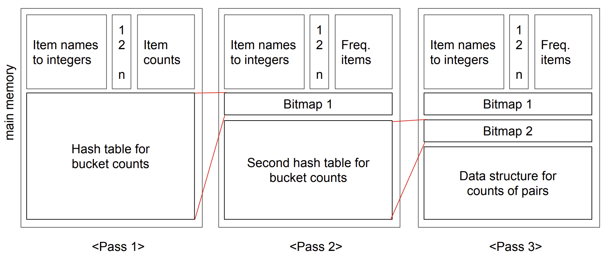

<br />

## Multistage Algorithm

데이터 마이닝에서 빈번한 아이템쌍을 찾는 과정에서 공간을 줄이기 위한 해시 기반 알고리즘

해시 테이블을 한 번만 쓰는 PCY와 달리, 해시 과정을 여러 단계(Stage)로 나누어, 더 정밀하게 후보를 걸러냄


<br />

## Implementation

### Code

```python
from collections import defaultdict
from itertools import combinations

# Hash function for a pair of items with a seed
def hash_pair(pair, num_buckets, seed=0):
    return (hash(pair[0] + str(seed)) ^ hash(pair[1] + str(seed))) % num_buckets

# Multistage algorithm implementation
def multistage(transactions, min_support, num_buckets=10):
    num_transactions = len(transactions)
    support_threshold = min_support * num_transactions

    # Step 1: Count individual items
    item_counts = defaultdict(int)
    for transaction in transactions:
        for item in transaction:
            item_counts[item] += 1

    # Get frequent items that meet the support threshold
    freq_items = {item for item, count in item_counts.items() if count >= support_threshold}

    # Step 2: First hash table for pairs
    hash_table1 = [0] * num_buckets
    for transaction in transactions:
        freq_items_in_tran = [item for item in transaction if item in freq_items]
        for pair in combinations(sorted(freq_items_in_tran), 2):
            bucket = hash_pair(pair, num_buckets, seed=1)
            hash_table1[bucket] += 1

    # Create bitmap1 from first hash table
    bitmap1 = [count >= support_threshold for count in hash_table1]

    # Step 3: Second hash table for filtered pairs
    hash_table2 = [0] * num_buckets
    for transaction in transactions:
        freq_items_in_tran = [item for item in transaction if item in freq_items]
        for pair in combinations(sorted(freq_items_in_tran), 2):
            bucket1 = hash_pair(pair, num_buckets, seed=1)
            if bitmap1[bucket1]:
                bucket2 = hash_pair(pair, num_buckets, seed=2)
                hash_table2[bucket2] += 1

    # Create bitmap2 from second hash table
    bitmap2 = [count >= support_threshold for count in hash_table2]

    # Step 4: Count candidate pairs that pass both filters
    pair_counts = defaultdict(int)
    for transaction in transactions:
        freq_items_in_tran = [item for item in transaction if item in freq_items]
        for pair in combinations(sorted(freq_items_in_tran), 2):
            bucket1 = hash_pair(pair, num_buckets, seed=1)
            bucket2 = hash_pair(pair, num_buckets, seed=2)
            if bitmap1[bucket1] and bitmap2[bucket2]:
                pair_counts[pair] += 1

    # Step 5: Filter frequent pairs
    frequent_pairs = {pair: count for pair, count in pair_counts.items() if count >= support_threshold}
    frequent_items = {item: count for item, count in item_counts.items() if count >= support_threshold}

    return frequent_items, frequent_pairs

# Example transaction data
transactions = [
    {'bread', 'milk'},
    {'bread', 'diaper', 'beer', 'egg'},
    {'milk', 'diaper', 'beer', 'cola'},
    {'bread', 'milk', 'diaper', 'beer'},
    {'bread', 'milk', 'diaper', 'cola'},
]

# Minimum support threshold
min_support = 0.6  # For example, 60% of all transactions

# Run multistage algorithm
frequent_items, frequent_pairs = multistage(transactions, min_support)

# Print results
print("Frequent Items:")
for item, count in frequent_items.items():
    print(f"{item}: {count}")

print("\nFrequent Pairs:")
for pair, count in frequent_pairs.items():
    print(f"{pair}: {count}")
```

<br />

---

### Example data

```python
transactions = [
    {'bread', 'milk'},                         # T1
    {'bread', 'diaper', 'beer', 'egg'},        # T2
    {'milk', 'diaper', 'beer', 'cola'},        # T3
    {'bread', 'milk', 'diaper', 'beer'},       # T4
    {'bread', 'milk', 'diaper', 'cola'},       # T5
]
min_support = 0.6  # 전체 거래의 60% 이상 → 0.6 * 5 = 3 이상이면 frequent
```

👉 총 거래수: 5

👉 지지도 기준: 3

<br />

---

### Step 1. Count individual items

각 아이템이 얼마나 자주 등장하는지 세고, `3번 이상` 등장한 것만 남김

| Item   | Count |
| ------ | ----- |
| bread  | 4 ✅  |
| milk   | 4 ✅  |
| diaper | 4 ✅  |
| beer   | 3 ✅  |
| egg    | 1 ❌  |
| cola   | 2 ❌  |

→ frequent 1-itemsets:

`{bread}, {milk}, {diaper}, {beer}`

<br />

---

### Step 2. First hash table (Seed = 1)

1. 각 transaction에서 frequent item으로만 구성한 후, transaction에서 가능한 2-itemset 조합 뽑기

예: `{bread, milk, diaper, cola}` → `{bread, milk, diaper}` → `{bread, milk}, {bread, diaper}, {milk, diaper}`

<p></p>

2. 조합을 뽑은 후 해싱 후 count

   해시 테이블 크기 = 10

   해시함수 = `hash_pair(pair, 10, seed=1)`

예: `{bread, milk}` → `bucket 1`, `{bread, diaper}` → `bucket 5`, ...

<p></p>

3. bucket의 count ≥ 3(support threshold 이상)인 곳만 True로 표시된 bitmap1 생성

예: `bitmap1 = [False, True, False, True, False, True, False, False, False, False]`

<br />

---

### Step 3. Second hash table (Seed = 2)

1. 각 transaction에서 frequent item으로만 구성한 후, transaction에서 가능한 2-itemset 조합 뽑기

예: `{bread, milk, diaper, cola}` → `{bread, milk, diaper}` → `{bread, milk}, {bread, diaper}, {milk, diaper}`

<p></p>

2. 앞에서 만든 bitmap1을 필터처럼 사용해서, 1차 해시 버킷이 frequent한 pair들만 다시 해싱 (seed=2)

예: `{bread, milk}`가 `bitmap1[해시값]=True` 였다면

→ 다시 해시해서 `hash_pair(pair, 10, seed=2)` 위치의 bucket에 카운트 증가

<p></p>

3. bucket의 count ≥ 3(support threshold 이상)인 곳만 True로 표시된 bitmap2 생성

예: `bitmap2 = [False, True, False, False, True, False, False, False, False, False]`

<br />

---

### Step 4. Count candidate pairs that pass both filters

각 transaction을 다시 한 번 순회하면서 frequent item으로만 조합한 2-itemset에 대해 1차/2차 bitmap을 모두 통과한 pair만 count

예: `{bread, milk}`의 경우
`bucket1 = 1` → `bitmap1[1] = True`
`bucket2 = 4` → `bitmap2[4] = True`
→ 이 쌍은 최종 후보(candidate)이므로, count += 1

<br />

---

### Step 5. Filter frequent 2-itemsets

pair count가 3(support threshold) 이상인 것만 최종 frequent pair로 남김

→ frequent 2-itemsets:

`{bread, milk}, {bread, diaper}, {bread, beer}, {milk, diaper}`

<br />

---

### Result

```python
Frequent Items:
bread: 4
milk: 4
diaper: 4
beer: 3

Frequent Pairs:
('bread', 'milk'): 3
('beer', 'diaper'): 3
('bread', 'diaper'): 3
('diaper', 'milk'): 3
```

<br />
<br />
<br />
<br />
