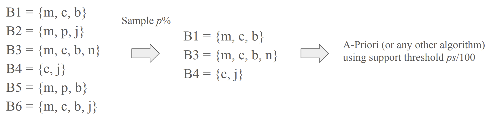
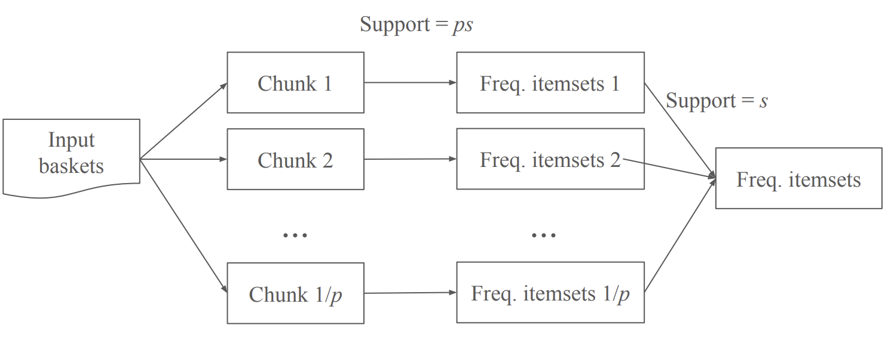
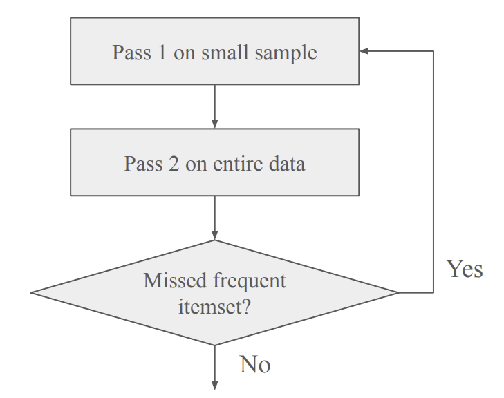

 

## Random Sampling Algorithm

1. **샘플링 (Sampling)**

   전체 m개의 바스켓 중에서 p%에 해당하는 pm/10개의 바스켓을 무작위로 샘플링

2. **Support Threshold 조정**

   전체 데이터에서의 최소 지지도(support threshold)가 s였다면, 샘플에서는 그 비율에 맞춰 ps/100으로 조정

3. **샘플에서 빈발 아이템셋 찾기**

   샘플에 대해 Apriori, PCY, Multistage, 또는 Multihash 알고리즘을 수행

 

## SON(Savasere, Omiecinski, Navathe) Algorithm

1. **데이터 분할 (Partitioning the Dataset)**

   전체 트랜잭션 데이터를 1/p개의 청크로 분할

2. **Support Threshold 조정**

   전체 데이터에서의 최소 지지도(support threshold)가 s였다면, 각 청크에서는 그 비율에 맞춰 ps으로 조정

3. **샘플에서 빈발 아이템셋 찾기**

   각 청크에 대해 Apriori, PCY, Multistage, 또는 Multihash 알고리즘을 수행하여 로컬 빈발 아이템셋을 탐색

4. **후보 아이템셋 통합 (Candidate Set Aggregation)**

   모든 청크에서 발견된 로컬 빈발 아이템셋들을 합쳐 전체 데이터에 대한 후보 아이템셋을 구성

5. **전체 데이터 검증 (Global Support Counting)**

   통합된 후보 아이템셋에 대해 전체 데이터셋에서의 실제 support를 계산한 후, support가 ≥s인 아이템셋만을 최종적으로 빈발 아이템셋으로 결정

특징: 각 청크는 독립적으로 처리되므로, 이 알고리즘은 MapReduce, Hadoop, Spark와 같은 분산 데이터 처리 프레임워크에서 병렬로 실행하기에 매우 적합

 

## Toivonen’s Algorithm

1. **샘플링 (Sampling)**

   전체 데이터에서 무작위로 일정 비율의 샘플을 뽑음

2. **샘플에서 빈발 아이템셋 찾기**

   샘플에 대해 support threshold를 조정한 후, Apriori, PCY, Multistage, Multihash 같은 알고리즘을 적용하여 샘플 내에서 빈발한 아이템셋을 찾음

3. **Negative Border 계산**

   샘플 내에서 빈발하지 않은 아이템셋 중, 빈발 아이템셋의 바로 위 단계(한 단계 더 큰 집합)에서 후보가 될 수 있는 아이템셋(경계 아이템셋)을 구함 → 이 집합을 Negative Border라고 함

4. **전체 데이터에서 검증 (Verification)**

   샘플에서 나온 빈발 아이템셋과 Negative Border 아이템셋을 모두 전체 데이터에서 검증

   Negative Border에 있는 아이템셋이 실제로 빈발하면, 샘플링이 실패한 것이므로 다시 샘플링해서 반복 수행

   Negative Border에 빈발 아이템셋이 없으면, 샘플에서 찾은 빈발 아이템셋이 전체 데이터의 정확한 빈발 아이템셋임을 보장

   
Negative Border

   
ex. 아이템셋 `{A,B,C,D}`는 샘플 내에서는 빈발하지 않았지만, 이 집합의 모든 즉각적인 부분집합 `{A,B,C}`, `{B,C,D}`, `{A,C,D}`, `{A,B,D}`가 모두 빈발하다면, `{A,B,C,D}`는 Negative Border에 포함됨

ex. 단일 아이템셋 `{E}`가 샘플에서는 빈발하지 않은 경우, 더 작은 부분집합이 없기 때문에 이 아이템셋은 그 자체로 Negative Border에 속함

 
 
 
 
