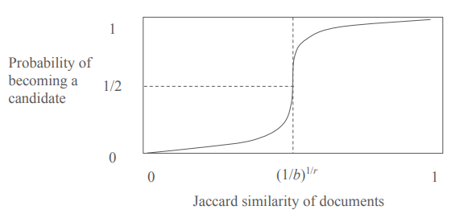

 

## LSH (Locality-Sensitive Hashing)

일반적으로 데이터가 너무 많으면 모든 쌍을 비교하는 건 비효율적임

LSH는 비슷한 것끼리 같은 버킷(bucket)에 들어갈 가능성이 높게 데이터를 해싱해서, 후보군만 비교하도록 만듦

- 비슷한 것 → 같은 버킷에 들어갈 확률 높음
- 다른 것 → 같은 버킷에 들어갈 확률 낮음

 

## 절차

1. 시그니처(signature) 생성
   - 예) minhash를 사용해 문서마다 해시값 벡터를 만듦
2. 밴드(band)로 나누기
   - 시그니처 벡터를 여러 밴드로 나눔
   - 각 밴드는 여러 해시값의 작은 그룹(row)으로 구성됨
3. 각 밴드에 해시 적용
   - 밴드 내의 값들을 결합해 하나의 해시값을 만듦
   - 같은 밴드 해시값을 가진 데이터들은 같은 버킷에 들어감
4. 후보군 비교
   - 같은 버킷에 있는 데이터들끼리만 유사도 계산

 

## 전략

밴드 수($b$)와 행 수($r$)를 조절하며 false positive와 false negative 조절

예시)

각 $r$개의 행으로 이루어진 $b$개의 밴드가 있다고 하고, 한 문서 쌍의 Jaccard similarity가 $s$라고 하자

한 문서 쌍이 하나의 밴드에서 모든 행이 일치할 확률 = $s^r$

한 문서 쌍이 하나의 밴드에서 하나라도 불일치할 확률 = $1-s^r$

한 문서 쌍이 각각의 밴드에서 하나라도 불일치할 확률 = $(1-s^r)^b$

한 문서 쌍이 적어도 하나의 밴드에서 모든 행이 일치할 확률 = $1-(1-s^r)^b$ = **candidate가 될 확률**

밴드 수($b$)와 행 수($r$)를 조절하며 그래프의 모양을 조절할 수 있음

 

## 예제 (LSH for MinHash Signatures)

예제로 minhash 알고리즘을 확장하여 LSH 기술을 적용하는 방법을 살펴보자

먼저 minhash 알고리즘으로 생성한 시그니처 행렬(signature matrix)이 있다고 하자

이를 2개의 밴드(b=2)로 나누고, 각 밴드는 3개의 행(r=3)으로 구성해 본다

| Hash Function | $S_1$ | $S_2$ | $S_3$ |
| ------------- | ----- | ----- | ----- |
| $g_1$         | 0     | 3     | 0     |
| $g_2$         | 1     | 2     | 1     |
| $g_3$         | 4     | 5     | 4     |
| $g_4$         | 3     | 4     | 4     |
| $g_5$         | 1     | 2     | 1     |
| $g_6$         | 2     | 2     | 2     |

1. 첫 번째 밴드 ($g_1$, $g_2$, $g_3$)

문서 $S_1$, $S_2$, $S_3$의 나눠진 signature 값은 각각 $\lbrace0, 1, 4\rbrace$, $\lbrace3, 2, 5\rbrace$, $\lbrace0, 1, 4\rbrace$이다.

이를 해시하여 각각의 bucket에 넣으면 다음과 같다
$S_1: h(\lbrace0, 1, 4\rbrace) → bucket 1$

$S_2: h(\lbrace3, 2, 5\rbrace) → bucket 2$

$S_3: h(\lbrace0, 1, 4\rbrace) → bucket 1$

문서 $S_1$과 $S_3$는 같은 bucket으로 해시되므로 두 문서 쌍 $(S_1, S_3)$는 candidate pair가 된다

2. 두 번째 밴드 ($g_4$, $g_5$, $g_6$)

문서 $S_1$, $S_2$, $S_3$의 나눠진 signature 값은 각각 $\lbrace3, 1, 2\rbrace$, $\lbrace4, 2, 2\rbrace$, $\lbrace4, 1, 2\rbrace$이다

이를 해시하여 각각의 bucket에 넣으면 다음과 같다
$S_1: h(\lbrace3, 1, 2\rbrace) → bucket 1$

$S_2: h(\lbrace4, 2, 2\rbrace) → bucket 2$

$S_3: h(\lbrace4, 1, 2\rbrace) → bucket 3$

같은 bucket에 해시된 문서 쌍이 없으므로 추가할 candidate pair은 없다

모든 밴드에서 candidate pair을 구했으면 각 candidate pair의 유사도를 측정한다

예제에서는 $(S_1, S_3)$의 Jaccard similarity를 구하면 된다

 
 
 
 
