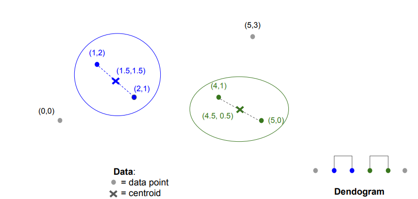
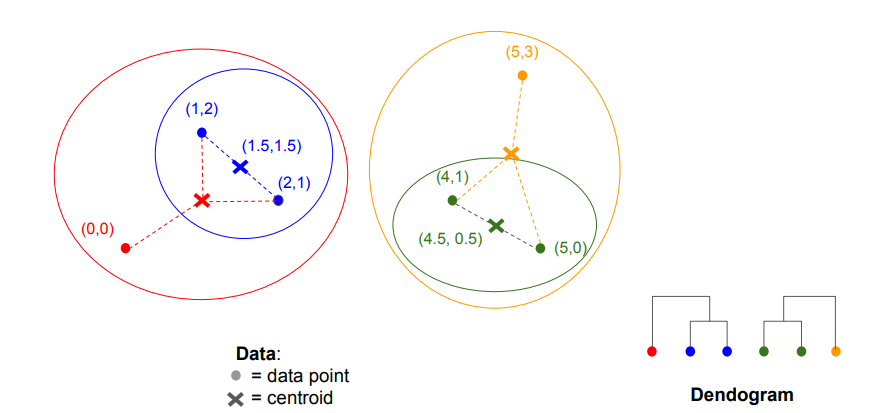

 

## Hierarchical Clustering

데이터를 계층적 구조(tree, dendrogram)로 군집화하는 방법

데이터를 한 번에 나누거나 합치는 것이 아니라, 점진적으로 군집을 합치거나 분리하면서 구조를 만들어 가는 방식

- Agglomerative (병합형):
  → 처음에는 각 데이터가 하나의 군집으로 시작
  → 가장 가까운 두 군집을 합치며 최종적으로 하나의 큰 군집이 됨
  → bottom-up 접근
- Divisive (분할형):
  → 처음에는 모든 데이터를 하나의 군집으로 시작
  → 점점 데이터를 나누어 최종적으로 개별 데이터까지 분할
  → top-down 접근

 

## 절차와 기준

### 절차

1. 모든 데이터 포인트를 개별 cluster로 시작
2. 각 cluster 간 거리 계산
3. 가장 가까운 두 cluster을 합침
4. 각 cluster 간 거리 재계산
5. 단계 3~4 반복
6. 병합 종료 기준에 따라 종료

---

### 거리 측정 기준

- Euclidean distance: 유클리드 거리
- Manhattan distance: 맨해튼 거리
- Cosine similarity: 코사인 유사도
- …

---

### 클러스터 병합 기준

- 최단 거리: 두 클러스터의 점 중 가장 가까운 두 점 간 거리
- 최장 거리: 두 클러스터의 점 중 가장 먼 두 점 간 거리
- 평균 거리 : 두 클러스터에서 각각 한 점씩 선택한 모든 조합의 거리 평균
- 클러스터 반경: 클러스터 중심과 각 점 간의 최대 거리
- 클러스터 직경: 클러스터 내 임의의 두 점 간 최대 거리
- …

---

### 클러스터 병합 종료 기준

- 병합된 클러스터의 직경이 임계값을 초과할 경우
- 병합된 클러스터의 밀도가 임계값 이하일 경우
- 병합된 클러스터가 부적절하다는 증거가 나타날 경우
- …

 

## Priority Queue을 이용한 Hierarchical Clustering

1. 모든 쌍의 거리를 계산하고 priority queue에 추가 - $O(n^2)$
2. 각 클러스터 병합 시, 해당 클러스터와 관련된 우선순위 큐의 모든 항목을 제거 - $O(n \log n)$
3. 새로운 클러스터와 남아 있는 클러스터 간의 거리를 모두 계산 - $O(n \log n)$

마지막 두 단계는 최대 $n$번 수행되므로, 전체 실행 시간은 $O(n^2 \log n)$

 

## 예제

 
 
 
 
