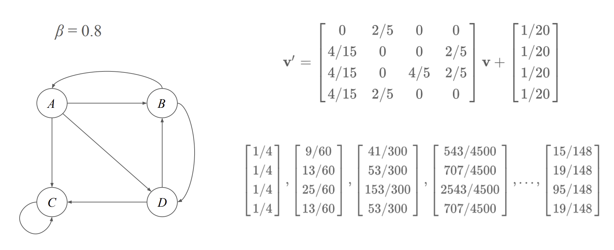
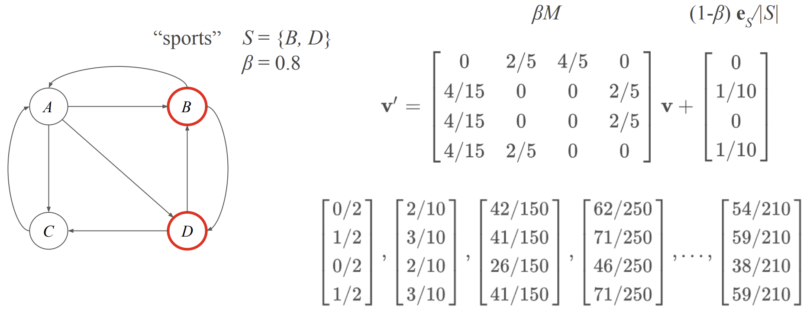

 

## Taxation

### 정의

- PageRank에서 Taxation은 웹 서핑 모델에서 무한 루프(Spider trap)나 막다른 페이지 문제(Dead end)를 해결하기 위해 도입된 확률 조정 메커니즘
  - Dead end: 링크가 전혀 없는 페이지에 도착하면 그 이후에는 아무 곳도 갈 수 없어 계산이 멈춤
  - Spider trap: 특정 페이지 집합 내부에서만 링크가 돌고 외부로 안 나가면, 확률이 거기에 갇혀버림
- 매 단계마다
  - 확률 $\beta$→ 현재 페이지의 링크를 따라 이동
  - 확률 $(1 − \beta)$ → 무작위 페이지로 랜덤 점프 (teleportation)

---

### 수식

$$
v' = \beta M v + (1 - \beta) \frac{e}{n}
$$

$v$ : 각 페이지의 중요도 확률 분포
$M$ : 전이 확률 행렬
$\beta$ : 링크를 따라가는 확률 (보통 0.8 ~ 0.9)
$e$ : 모든 원소가 1인 벡터 ($e=[1,1,1\dots,1]^T$)
$n$: 전체 노드(페이지) 수

---

### 예제

 

## Topic-Sensitive PageRank

### 정의

일반 PageRank에서는 텔레포트 확률 벡터가 모든 노드에 균등 분포로 설정

사용자가 임의의 페이지로 순간이동할 때 모든 페이지에 똑같이 갈 확률이 있음

하지만 Topic-Sensitive PageRank에서는 확률 벡터를 주제(Topic)에 맞게 편향시킴

ex) 스포츠 주제라면 스포츠 관련 웹페이지들에 더 높은 확률을 부여

---

### 수식

$$
v' = \beta M v + (1 - \beta) \frac{\mathbf{e}_S}{|S|}
$$

$S$: 주제 집합 (예: 스포츠와 관련된 페이지들의 집합)
$\mathbf{e}_S$: 텔레포트 집합 $S$ 내 위치는 1, 나머지는 0인 벡터
$|S|$: 집합 $S$의 크기

---

### 예제

---

### 적용

1. PageRank 벡터를 만들 주제를 결정
2. 각 주제별로 텔레포트 집합을 선택하고, Topic-Sensitive PageRank 점수를 계산
3. 주어진 특정 검색 쿼리에 대해 관련된 주제를 판별
4. 주제별 PageRank 벡터를 이용해 검색 쿼리에 대한 응답 결과의 순서를 매김

 
 
 
 
