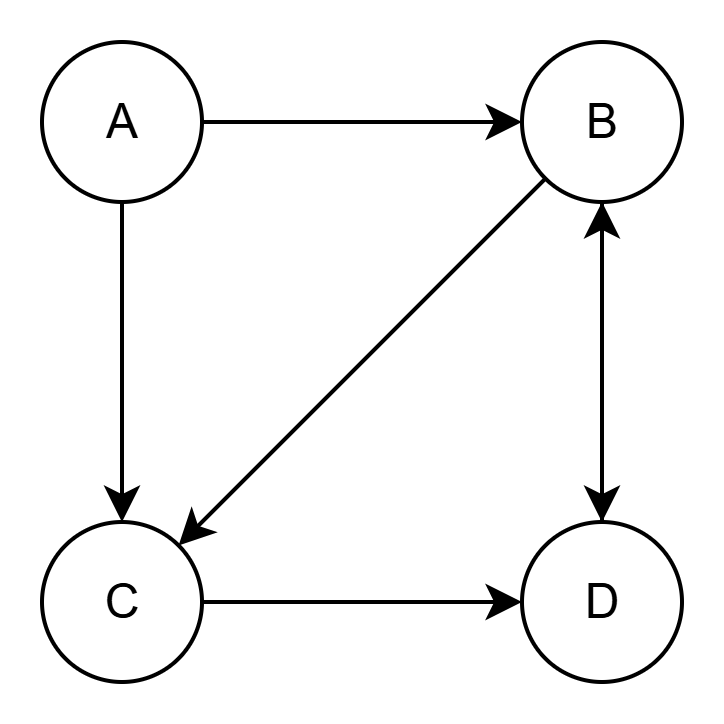

 

## 개념

웹 페이지나 노드들을 허브(Hub)와 권위(Authority)라는 두 가지 측면으로 평가

PageRank가 전반적 중요도를 나타낸다면, HITS는 특정 주제에 대한 허브성과 권위성을 측정

스팸 페이지나 주제 드리프트(topic drift)에 취약할 수 있음

 

## 핵심 아이디어

허브(Hub): 좋은 허브 페이지는 좋은 권위 페이지로 가는 링크를 많이 가짐 (ex. 스포츠 관련 사이트 목록 페이지)

권위(Authority): 좋은 권위 페이지는 좋은 허브 페이지로부터 많이 링크됨 (ex. 유명한 스포츠 뉴스 사이트)

허브와 권위는 서로 서로 강화되는 관계임

 

## 알고리즘 절차

1. 주제별 서브그래프 생성

   검색 질의나 필터링으로 관련 있는 웹 페이지 집합을 선택

2. 허브 점수와 권위 점수 초기화

   모든 페이지의 허브 점수 $h(p)$와 권위 점수 $a(p)$를 1로 시작

3. 갱신 규칙 반복
   권위 점수 갱신: $\mathbf{a} = A^T \mathbf{h}$

   허브 점수 갱신: $\mathbf{h} = A \mathbf{a}$

4. 정규화 (Normalization)

   벡터 크기를 1로 맞춰서 값이 발산하지 않도록 함

5. 수렴할 때까지 3~4 반복

 

## 예시

### Step 1. 초기 설정

**그래프**

  

 

**인접 행렬**

행렬 $A$에서 $A_{ij} = 1$이면 i에서 j로 링크 있음을 뜻함

$$
A =
\begin{bmatrix}
0 & 1 & 1 & 0 \cr
0 & 0 & 1 & 1 \cr
0 & 0 & 0 & 1 \cr
0 & 1 & 0 & 0
\end{bmatrix}
$$

(행 = 출발 노드, 열 = 도착 노드, 순서: A, B, C, D)

 

**초기값**

모든 허브/권위 점수를 1로 시작

$$
h^{(0)} =
\begin{bmatrix}
1 \cr
1 \cr
1 \cr
1
\end{bmatrix}
$$

$$
a^{(0)} =
\begin{bmatrix}
1 \cr
1 \cr
1 \cr
1
\end{bmatrix}
$$

 

---

### Step 2. 1회 반복

**권위 점수 갱신**

$$
a^{(1)} = A^T h^{(0)} =
\begin{bmatrix}
0 \cr
2 \cr
2 \cr
2
\end{bmatrix}
$$

 

**허브 점수 갱신**

$$
h^{(1)} = A a^{(1)} =
\begin{bmatrix}
4 \cr
4 \cr
2 \cr
2
\end{bmatrix}
$$

 

**정규화**

허브와 권위 점수 크기를 1로 맞춤

$$
||a^{(1)}|| = \sqrt{0^2 + 2^2 + 2^2 + 2^2} = \sqrt{12} \approx 3.464
$$

$$
a^{(1)}_{\text{norm}} \approx
\begin{bmatrix}
0 \cr
0.577 \cr
0.577 \cr
0.577
\end{bmatrix}
$$

$$
||h^{(1)}||=\sqrt{4^2+4^2+2^2+2^2}=\sqrt{40}\approx6.3249
$$

$$
h^{(1)}_{\text{norm}} \approx
\begin{bmatrix}
0.632 \cr
0.632 \cr
0.316 \cr
0.316
\end{bmatrix}
$$

 

---

### Step 3. 반복

이 과정을 5~10번 반복하면 수렴

최종적으로

**B, C, D** → 권위 점수 높음 (좋은 허브들로부터 링크 받음)

**A, B** → 허브 점수 높음 (좋은 권위 페이지로 링크함)

 
 
 
 
