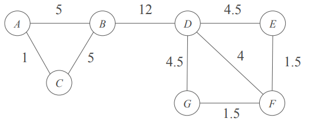
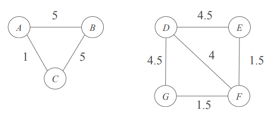

 

## Beweenness

간선 e의 Betweenness는 모든 노드 쌍 (x, y) 중에서, 간선 e가 x와 y 사이의 최단 경로 위에 포함되는 경우의 수를 나타냄

$$
C_B(e) = \sum_{s \ne t \in V} \frac{\sigma_{st}(e)}{\sigma_{st}}
$$

- $\sigma_{st}$: 노드 s에서 t로 가는 최단 경로의 수
- $\sigma_{st}(e)$: 노드 s와 t사이의최단 경로 중 간선 e를 포함하는 경로의 수

예시)

 

## Using Beweenness to Find Communities

- 그래프의 모든 간선을 포함한 상태에서 시작하여, betweenness 값이 가장 높은 간선을 제거
- 그래프가 원하는 수의 연결된 부분 그래프로 나뉠 때까지 이 과정을 반복

예시) Betweenness 값이 가장 높은 간선 {B, D}를 제거하면, 다음과 같은 클러스터링이 가능

 
 
 
 
