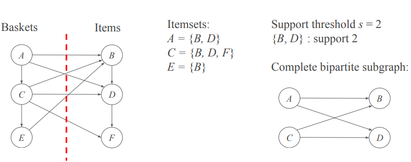

 

## Background

- 커뮤니티는 노드 간의 간선 밀도를 바탕으로 직접 탐색할 수 있음
- 이를 위해 clique를 찾는 방법이 제안되었지만, 이는 NP-Complete 문제로 계산 비용이 매우 큼
- 따라서, 보다 효율적인 접근으로 **Complete Bipartite Subgraph** 탐색 기반의 클러스터링 방법을 사용할 수 있음

 

## Finding Complete Bipartite Subgraphs

1. 일반 그래프의 경우, 노드들을 무작위로 두 개의 동일한 크기 그룹으로 나눔

   k-분할 그래프일 경우, 두 종류의 노드와 그들 사이의 간선만을 선택해 이분 그래프를 구성

2. 빈발 항목 집합 문제(frequent itemsets problem)로 변환하여 해결

 
 
 
 
