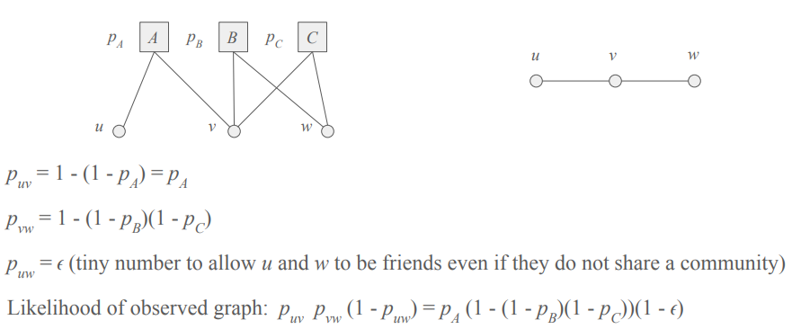

 

## MLE (Maximum Likelihood Estimation)

### 정의

어떤 확률분포 $p(x \mid \theta)$가 있고, 우리가 관측한 데이터가 $x_1, x_2, \dots, x_n$일 때,

우도 함수(likelihood function)는 다음과 같음:

$$
L(\theta) = P(x_1, x_2, \dots, x_n \mid \theta) = \prod_{i=1}^{n} p(x_i \mid \theta)
$$

MLE는 이 우도 함수 $L(\theta)$를 최대화하는 $\theta$ 값을 찾는 것:

 $$ \hat{\theta}_{MLE} = \arg\max_{\theta} L(\theta) $$ 

보통 로그를 취해서 로그 우도(log-likelihood)로 계산:

$$
\ell(\theta) = \log L(\theta) = \sum_{i=1}^n \log p(x_i \mid \theta)
$$

---

### 예제

동전을 10번 던졌더니 7번 앞면이 나왔다고 할 때, 앞면이 나올 확률 $\theta$를 추정하고 싶다면,

$$
L(\theta) = \theta^7 (1 - \theta)^3
$$

이걸 최대화하는 $\theta$를 구하면:

$$
\hat{\theta}_{MLE} = \frac{7}{10} = 0.7
$$

즉, MLE는 관측된 결과를 가장 잘 설명하는 확률 $\theta = 0.7$이라고 추정

 

## AGM (Affiliation Graph Model)

### 정의

노드가 소속된 커뮤니티(affiliations)에 기반하여 네트워크 구조를 생성하거나 해석하는 확률적 그래프 모델

노드는 하나 이상의 커뮤니티에 소속되어 있고, 두 노드 간의 연결 여부는 그들이 공유하는 커뮤니티에 기반해 결정된다는 아이디어에서 출발

ex. 사람들이 영화 동호회, 독서 모임 등 여러 커뮤니티에 속해 있다고 했을 때, 두 사람이 같은 모임에 속해 있을수록 친구가 될 가능성이 높다는 가정에서 출발

---

### 수식

**간선 연결 확률**

노드 $u$와 $v$가 공유하는 커뮤니티 집합을 $C_{uv}$라고 할 때,

각 커뮤니티 $c \in C_{uv}$는 고유한 연결 확률 $p_c$를 가진다고 가정하면,

두 노드 사이에 간선이 존재할 확률은 다음과 같이 주어짐:

$$
P(u \leftrightarrow v) = 1 - \prod_{c \in C_{uv}} (1 - p_c)
$$

즉, 둘이 공유하는 커뮤니티 중 하나라도 간선을 만들면 연결되는 방식

**전체 그래프의 Likelihood**

관측된 전체 그래프 $G = (V, E)$의 우도(likelihood)는 다음과 같이 계산:

$$
\mathcal{L} = \prod_{(u, v) \in E} P(u \leftrightarrow v) \prod_{(u, v) \notin E} \left(1 - P(u \leftrightarrow v)\right)
$$

- 앞 곱: 실제로 연결된 노드쌍은 연결될 확률을 곱함
- 뒤 곱: 연결되지 않은 노드쌍은 연결되지 않을 확률을 곱함

이걸 최대화하는 $p_c$나 affiliation 설정을 찾는 것이 모델 학습 목표임

---

### 예제

 

## BigCLAM (Cluster Affiliation Model for Big Networks)

### 정의

커뮤니티 탐지(Community Detection)를 위한 대표적인 확률 기반 모델 중 하나

기존의 Affiliation Graph Model (AGM)을 확장한 모델로, 노드가 여러 커뮤니티에 부분적으로 소속될 수 있음을 수치적으로 표현

노드는 여러 커뮤니티에 동시에 소속될 수 있으며, 각 소속 정도는 연속적인 값으로 표현

→ 노드 $u$의 커뮤니티 소속 벡터를 $\mathbf{f}_u$로 나타냄

---

### 수식

**간선 연결 확률**

노드 $u$와 $v$가 각 커뮤니티 $c$에 대해 소속된 강도를 각각 $f_{uc}, f_{vc}$라고 할 때,

간선이 생성될 확률은 다음과 같이 정의:

$$
P(u \leftrightarrow v) = 1 - \exp\left( - \sum_{c=1}^{C} f_{uc} f_{vc} \right)
$$

**전체 그래프의 Likelihood**

관측된 전체 그래프 $G = (V, E)$의 우도(likelihood)는 다음과 같이 계산:

$$
\mathcal{L} = \prod_{(u,v) \in E} \left(1 - \exp\left( - \sum_{c} f_{uc} f_{vc} \right)\right) \times \prod_{(u,v) \notin E} \exp\left( - \sum_{c} f_{uc} f_{vc} \right)
$$

위의 likelihood 식에 로그를 취하면:

$$
\mathcal{L} = \sum_{(u,v) \in E} \log\left(1 - \exp\left( - \sum_{c} f_{uc} f_{vc} \right)\right) - \sum_{(u,v) \notin E} \sum_{c} f_{uc} f_{vc}
$$

 
 
 
 
