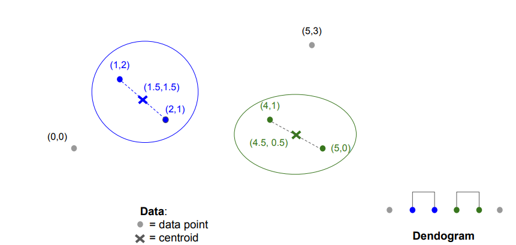

 

## Normalized Cut

Normalized Cut은 그래프를 두 개 이상의 부분 그래프로 나눌 때, 단순히 연결된 간선의 가중치 합을 최소화하는 것뿐만 아니라, 각 부분 그래프 내의 연결 강도(연결성)를 함께 고려하여 균형 잡힌 분할을 목표로 하는 방법임

 

## 수식

$$
{Ncut}(S, T) = \frac{\text{cut}(S, T)}{\text{vol}(S)} + \frac{\text{cut}(S, T)}{\text{vol}(T)}
$$

- $\text{cut}(S, T)$: 집합 S와 T를 연결하는 간선 수
- $\text{vol}(S)$: S에 속한 노드들과 연결된 전체 간선 수
- $\text{vol}(T)$: T에 속한 노드들과 연결된 전체 간선 수

 

## 예시

간선 {B, D}와 {C, G}를 자르는 컷의 **Normalized Cut** 값은 다음과 같이 계산됨

$$
\frac{2}{6} + \frac{2}{7} = 0.62
$$

이보다 더 작은 Normalized Cut은 존재하지 않으므로, 해당 컷이 최적의 컷(best cut)이며,

이에 따른 클러스터링 결과는 그림과 같음

 
 
 
 
