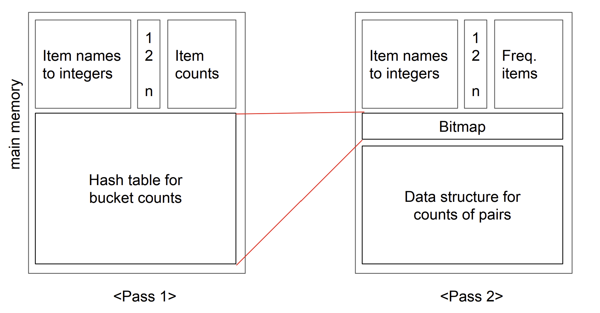

<br />

## PCY Algorithm

PCY(Park-Chen-Yu) 알고리즘은 Apriori 알고리즘의 확장 버전으로, 2-itemset 후보 생성 시 메모리를 아끼기 위해 비트맵과 해시를 사용하는 방법

기본적으로 2-itemsets까지만 처리

<p></p>



1-pass:

- 각 아이템의 support(지지도)를 구함
- 동시에 2-itemset을 해시해서 해시 버킷 카운트를 저장

2-pass:

- support가 충분한 1-itemset으로만 2-itemset 후보를 만듦
- 그 후보를 해시 버킷으로 매핑
- 그 버킷이 support threshold를 넘었는지 비트맵으로 확인
- 비트맵이 1인 경우만 후보로 간주

<p></p>

즉, 불필요한 2-itemset 후보들을 미리 제거해서 속도와 메모리 효율을 높이는 알고리즘

<br />

## Implementation

### Code

```python
from collections import defaultdict
from itertools import combinations

def pcy(transactions, min_support, num_buckets=10):
    num_transactions = len(transactions)
    support_threshold = min_support * num_transactions

    item_counts = defaultdict(int)
    bucket_counts = [0] * num_buckets

    # First Pass: Count individual items and hash 2-itemsets
    for transaction in transactions:
        for item in transaction:
            item_counts[item] += 1
        for pair in combinations(sorted(transaction), 2):
            bucket = hash(pair) % num_buckets
            bucket_counts[bucket] += 1

    # Make bitmap
    bitmap = [1 if count >= support_threshold else 0 for count in bucket_counts]

    # Frequent 1-itemsets
    frequent_items = {
        (item,): count / num_transactions
        for item, count in item_counts.items()
        if count >= support_threshold
    }

    frequent_item_set = set(item[0] for item in frequent_items)

    # Second Pass: Generate and filter candidate 2-itemsets using bitmap
    pair_counts = defaultdict(int)
    for transaction in transactions:
        frequent_item_list = [item for item in transaction if item in frequent_item_set]
        for pair in combinations(sorted(frequent_item_list), 2):
            bucket = hash(pair) % num_buckets
            if bitmap[bucket]:  # Only consider pairs in "frequent" buckets
                pair_counts[pair] += 1

    # Frequent 2-itemsets
    frequent_pairs = {
        pair: count / num_transactions
        for pair, count in pair_counts.items()
        if count >= support_threshold
    }

    return frequent_items, frequent_pairs

transactions = [
    {'bread', 'milk'},
    {'bread', 'diaper', 'beer', 'egg'},
    {'milk', 'diaper', 'beer', 'cola'},
    {'bread', 'milk', 'diaper', 'beer'},
    {'bread', 'milk', 'diaper', 'cola'}
]

min_support = 0.6
frequent_items, frequent_pairs = pcy(transactions, min_support)

print("✅ Frequent 1-itemsets:")
for itemset, support in frequent_items.items():
    print(f"{itemset} : {support:.2f}")

print("\n✅ Frequent 2-itemsets:")
for pair, support in frequent_pairs.items():
    print(f"{pair} : {support:.2f}")
```

<br />

---

### Example data

```python
transactions = [
    {'bread', 'milk'},
    {'bread', 'diaper', 'beer', 'egg'},
    {'milk', 'diaper', 'beer', 'cola'},
    {'bread', 'milk', 'diaper', 'beer'},
    {'bread', 'milk', 'diaper', 'cola'}
]
min_support = 0.6
```

- 총 거래 수: 5
- 지지도 기준: 0.6 × 5 = 3

<br />

---

### Step 1. Count individual items

각 아이템의 등장 횟수

| Item   | Count |
| ------ | ----- |
| bread  | 4 ✅  |
| milk   | 4 ✅  |
| diaper | 4 ✅  |
| beer   | 3 ✅  |
| egg    | 1 ❌  |
| cola   | 2 ❌  |

→ frequent 1-itemsets:

`{bread}, {milk}, {diaper}, {beer}`

<br />

---

### Step 2. Hash 2-itemsets

1. 각 transaction에서 가능한 2-itemset 조합을 만듦

예: `{bread, milk, diaper, cola}` → `{bread, milk}, {bread, diaper}, {bread, cola}, {milk, diaper}, {milk, cola}, {diaper, cola}`

<p></p>

2. 해시 함수를 통해 10개의 bucket 중 하나에 할당 후 count

예: `{bread, milk}` → `bucket 1`, `{bread, diaper}` → `bucket 5`, ...

<p></p>

3. bucket의 count ≥ 3(support threshold 이상)인 곳만 1로 표시된 bitmap 생성

```python
bitmap = [1 if count ≥ 3 else 0 for count in bucket_counts]

```

<br />

---

### Step 3. Finding frequent 2-itemsets

1. 각 transaction에서 가능한 2-itemset 조합을 만듦

예: `{bread, milk, diaper, cola}` → `{bread, milk}, {bread, diaper}, {bread, cola}, {milk, diaper}, {milk, cola}, {diaper, cola}`

<p></p>

2. 해시 함수를 통해 10개의 bucket 중 하나에 할당 후 bitmap 확인
   bitmap이 1일 경우, pair count를 1 증가

예: `{bread, milk}` → `bitmap[bucket 1] = 1` → `count += 1`, ...

<p></p>

3. pair count가 3(support threshold) 이상인 것만 최종 frequent pair로 남김

→ frequent 2-itemsets:

`{bread, milk}, {bread, diaper}, {bread, beer}, {milk, diaper}`

<br />

---

### Result

✅ Frequent 1-itemsets

```
('bread',) : 0.80
('milk',) : 0.80
('diaper',) : 0.80
('beer',) : 0.60
```

<br />

✅ Frequent 2-itemsets

```
('bread', 'milk') : 0.60
('beer', 'diaper') : 0.60
('bread', 'diaper') : 0.60
('diaper', 'milk') : 0.60
```

<br />
<br />
<br />
<br />
