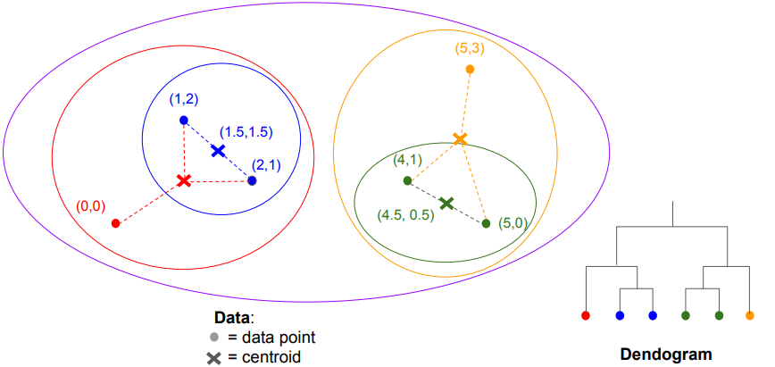

 

## PageRank란?

PageRank는 구글 검색 엔진의 핵심 알고리즘 중 하나로, 웹페이지의 중요도를 계산해 순위를 매기는 방법

많은 중요한 페이지로부터 링크를 많이 받은 페이지가 중요하다는 아이디어로 시작

 

## 작동 원리

### 원리

PageRank는 웹페이지의 중요도를 랜덤 서퍼 모델로 계산

랜덤 서퍼는 웹페이지에서 링크를 따라 무작위로 이동하거나, 특정 확률로 아무 페이지로나 점프함

1. 확률 분포 벡터 ($v$)

   웹페이지의 상태는 확률 벡터로 표현됨

   이 벡터의 j번째 성분은 서퍼가 현재 페이지 j에 있을 확률임

2. 초기 상태

   n개의 페이지 중 아무 페이지에서나 동일한 확률로 시작한다고 가정하면, 초기 벡터 $v$의 각 성분은 $\frac{1}{n}$

3. 전이 행렬 (Transition Matrix)

   $M$은 웹의 링크 구조를 기반으로 만든 전이 확률 행렬임

   $k$번 클릭(이동)한 뒤 서퍼의 확률 분포는 $M^kv$로 계산됨

4. 수렴

   $k$를 계속 늘리면 확률 벡터는 안정적인 값으로 수렴

   이 수렴 벡터가 각 페이지의 PageRank 값임

---

### 수식

위 원리를 행렬로 표현하면

$v = M v$

---

### 예시

행렬과 초기벡터

$$
M=\begin{bmatrix}
0 & \tfrac12 & 1 & 0 \cr
\tfrac13 & 0 & 0 & \tfrac12 \cr
\tfrac13 & 0 & 0 & \tfrac12 \cr
\tfrac13 & \tfrac12 & 0 & 0
\end{bmatrix},\qquad
v=\begin{bmatrix}\tfrac14\cr\tfrac14\cr\tfrac14\cr\tfrac14\end{bmatrix}
$$

각 단계별 계산 결과

$$
Mv=\begin{bmatrix}\tfrac{3}{8}\cr\tfrac{5}{24}\cr\tfrac{5}{24}\cr\tfrac{5}{24}\end{bmatrix}
$$

$$
M^2v=\begin{bmatrix}\tfrac{5}{16}\cr\tfrac{11}{48}\cr\tfrac{11}{48}\cr\tfrac{11}{48}\end{bmatrix}\quad
$$

$$
M^3v=\begin{bmatrix}\tfrac{11}{32}\cr\tfrac{7}{32}\cr\tfrac{7}{32}\cr\tfrac{7}{32}\end{bmatrix}\quad
$$

반복을 계속하면 벡터는 수렴하며, 수렴값은

$$
\begin{bmatrix}\tfrac{1}{3}\cr\tfrac{2}{9}\cr\tfrac{2}{9}\cr\tfrac{2}{9}\end{bmatrix}
$$

위의 예시에서는 반복 계산을 통해 $v$가 수렴하는 과정을 보여주었지만, 수렴 벡터는 곧 $v = M v$를 만족하는 고유벡터(eigenvector)이므로, 이 연립방정식을 직접 풀어서도 $v$를 구할 수 있음

 
 
 
 
