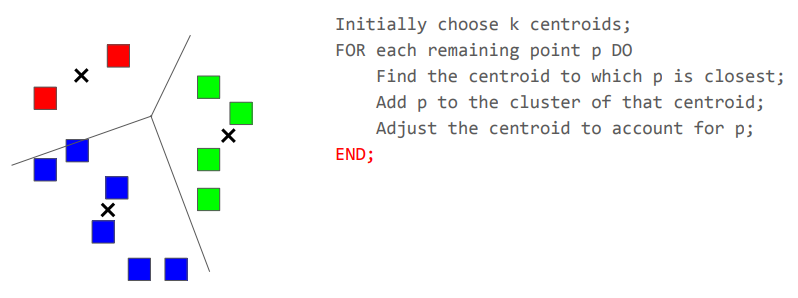

 

## 정의

특정 노드에서 시작한 random walker가 그래프 위를 이동하는 경로와 도착 위치를 통해, 같은 유형의 노드들 사이의 유사도를 측정하는 방법

 

## 수식

$$
v' = \beta M v + (1 - \beta) e_N
$$

$N$ : 시작 노드
$v'$ : 각 노드별 도착 확률
$M$ : 전이 확률 행렬 (Transition Matrix)
$1-\beta$ : N으로 텔레포트할 확률
$e_n$ : $N$ 위치에만 1 값을 가지고, 나머지 위치는 모두 0인 벡터

 

## 예제

결과: Picture 2보다 Picture 3이 Picture 1과 더 비슷함

(참고: 위 분석은 Picture 1에만 적용되며, 다른 것들은 분석을 다시 해야 함)

 
 
 
 
