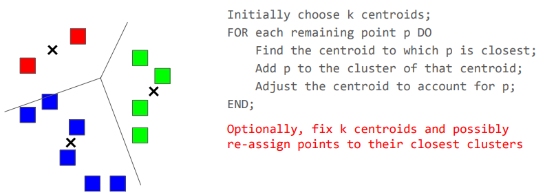

 

## Significance of Triangles

- 사회 네트워크에는 무작위 그래프보다 삼각형(서로 연결된 3개의 노드)이 더 많이 존재
- 친구의 친구도 친구일 가능성이 높아, 친구 관계가 삼각형 형태를 자주 만듦
- 커뮤니티의 나이(성숙도)는 그래프 내 삼각형 밀도와 비례

 

## Algorithm

### Assumption

- 그래프의 간선 (edge) 수: $m$
- 어떤 노드의 차수(degree)가 적어도 $\sqrt{m}$일 때, 그 노드는 heavy hitter
  heavy hitter 노드의 개수는 많아야 $2\sqrt{m}$개를 넘지 않음

 

---

### Step 1. Count heavy hitter triangles

1. heavy hitter 노드들로 이루어진 모든 3개 조합(triplets)을 찾기 - $O(m^{3/2})$
2. edge index를 사용해서 세 개의 간선이 모두 존재하는지를 검사 후 카운트 - $O(1)$

시간 복잡도: $O(m^{3/2})$

 

---

### Step2. Count other triangles

> $v<u$ iff
> (1) degree($v$) < degree($u$) or
> (2) degree are same, but $v<u$

1. 적어도 한 노드가 heavy hitter가 아닌 간선 $(v_1, v_2)$를 찾기 ($v_1<v_2$라고 가정) - $O(m)$
2. 간선 $v_1$에 인접한 노드 $u_1, u_2, …, u_k$ 찾기 - $O(m^{1/2})$
3. 각 $u_i$에 대해, edge pair index를 사용해 간선 $(u_i, v_2)$ 또는 $(v_2, u_i)$ 가 있는지 확인 - $O(1)$
4. 위 간선이 존재하고 $v_1<v_2<u_i$ 일 경우, triangle $\{v_1, v_2, u_i\}$을 카운트 - $O(1)$

시간 복잡도: $O(m^{3/2})$

 
 
 
 
