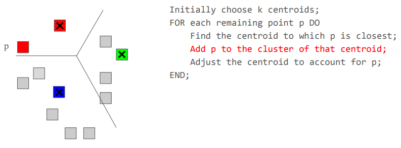

 

## TrustRank

### 정의

웹 페이지의 신뢰도를 평가하는 알고리즘

기본적으로 PageRank가 페이지의 중요도를 평가하는 반면, TrustRank는 스팸 페이지와 신뢰할 만한 페이지를 구분하는 데 초점을 둠

TrustRank = Topic-Sensitive PageRank의 한 형태로, ‘Trustworthiness’라는 특정 주제에 집중한 것

---

### 수식

$$
v' = \beta M v + (1 - \beta) \frac{\mathbf{e}_S}{|S|}
$$

$S$: 신뢰할만한 페이지 집합

$\mathbf{e}_S$: 텔레포트 집합 $S$ 내 위치는 1, 나머지는 0인 벡터

$|S|$: 집합 $S$의 크기

 

## Spam Mass

### 정의

한 페이지가 가진 전체 중요도(예: PageRank) 중에서 얼마나 많은 부분이 스팸으로 의심되는 부분에서 기인하는지를 나타냄

---

### 수식

$$
\text{Spam Mass}(p) = \frac{\text{PageRank}(p) - \text{TrustRank}(p)}{\text{PageRank}(p)}\qquad(p는 웹 페이지)
$$

---

### 예제

spam mass가 1에 가까울 수록 스탬일 확률이 높음

 
 
 
 
