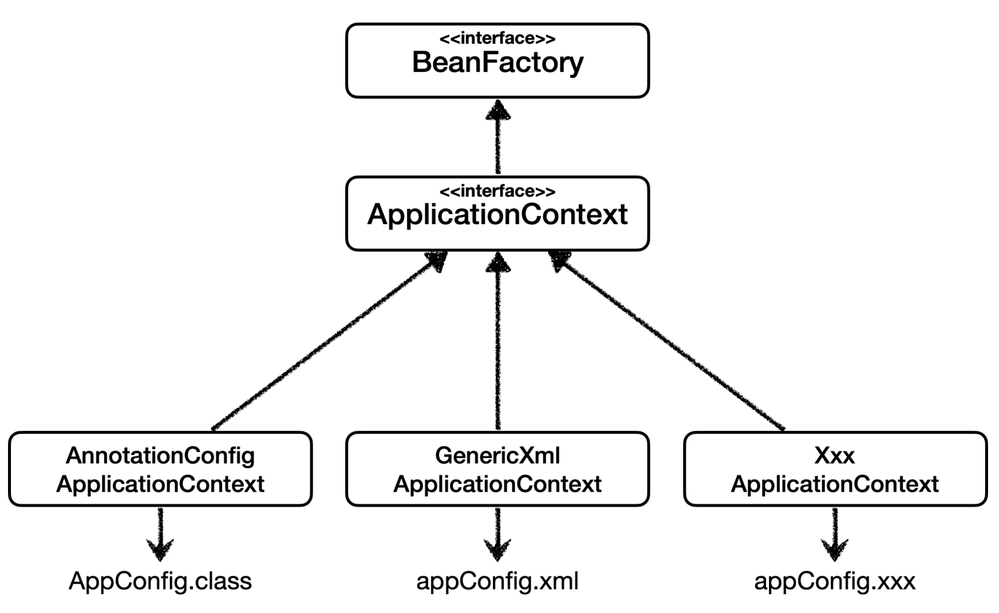
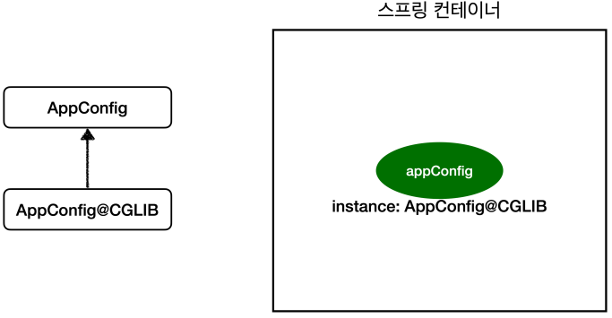

BeanFactory와 ApplicationContext
beanFactory와 ApplicationContext에 대해서 알아보자.


BeanFactory
스프링 컨테이너의 최상위 인터페이스다.
스프링 빈을 관리하고 조회하는 역할을 담당한다.
getBean() 을 제공한다.
지금까지 우리가 사용했던 대부분의 기능은 BeanFactory가 제공하는 기능이다.
ApplicationContext
BeanFactory 기능을 모두 상속받아서 제공한다.
빈을 관리하고 검색하는 기능을 BeanFactory가 제공해주는데, 그러면 둘의 차이가 뭘까?
애플리케이션을 개발할 때는 빈을 관리하고 조회하는 기능은 물론이고, 수 많은 부가기능이 필요하다.
ApplicatonContext가 제공하는 부가기능

메시지소스를 활용한 국제화 기능
예를 들어서 한국에서 들어오면 한국어로, 영어권에서 들어오면 영어로 출력
환경변수
로컬, 개발, 운영등을 구분해서 처리
애플리케이션 이벤트
이벤트를 발행하고 구독하는 모델을 편리하게 지원
편리한 리소스 조회
파일, 클래스패스, 외부 등에서 리소스를 편리하게 조회
정리
ApplicationContext는 BeanFactory의 기능을 상속받는다.
ApplicationContext는 빈 관리기능 + 편리한 부가 기능을 제공한다.
BeanFactory를 직접 사용할 일은 거의 없다. 부가기능이 포함된 ApplicationContext를 사용한다.
BeanFactory나 ApplicationContext를 스프링 컨테이너라 한다.


다양한 설정 형식 지원 - 자바 코드, XML
스프링 컨테이너는 다양한 형식의 설정 정보를 받아들일 수 있게 유연하게 설계되어 있다.
자바 코드, XML, Groovy 등등


애노테이션 기반 자바 코드 설정 사용
지금까지 했던 것이다.
new AnnotationConfigApplicationContext(AppConfig.class)
AnnotationConfigApplicationContext 클래스를 사용하면서 자바 코드로된 설정 정보를 넘기면 된다.
XML 설정 사용
최근에는 스프링 부트를 많이 사용하면서 XML기반의 설정은 잘 사용하지 않는다. 아직 많은 레거시 프로젝트 들
이 XML로 되어 있고, 또 XML을 사용하면 컴파일 없이 빈 설정 정보를 변경할 수 있는 장점도 있으므로 한번쯤
배워두는 것도 괜찮다.
GenericXmlApplicationContext 를 사용하면서 xml 설정 파일을 넘기면 된다.


```java
ApplicationContext ac = new GenericXmlApplicationContext("appConfig.xml");
```

```xml
<?xml version="1.0" encoding="UTF-8"?>
<beans xmlns="http://www.springframework.org/schema/beans"
       xmlns:xsi="http://www.w3.org/2001/XMLSchema-instance"
       xsi:schemaLocation="http://www.springframework.org/schema/beans http://www.springframework.org/schema/beans/spring-beans.xsd">
    <bean id="memberService" class="hello.core.member.MemberServiceImpl">
        <constructor-arg name="memberRepository" ref="memberRepository" />
    </bean>
    <bean id="memberRepository"
          class="hello.core.member.MemoryMemberRepository" />
    <bean id="orderService" class="hello.core.order.OrderServiceImpl">
        <constructor-arg name="memberRepository" ref="memberRepository" />
        <constructor-arg name="discountPolicy" ref="discountPolicy" />
    </bean>
    <bean id="discountPolicy" class="hello.core.discount.RateDiscountPolicy" />
</beans>
```