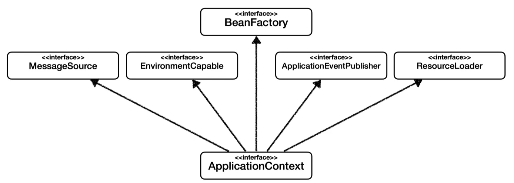

<br />

## AppConfig로 

```java
// AppConfig.java
@Configuration
public class AppConfig {

    @Bean
    public MemberService memberService(){
        return new MemberServiceImpl(memberRepository());
    }

    @Bean
    public MemoryMemberRepository memberRepository() {
        return new MemoryMemberRepository();
    }
}
```

```java
// MemberServiceImpl.java
public class MemberServiceImpl implements MemberService{

    private final MemberRepository memberRepository;

    public MemberServiceImpl(MemberRepository memberRepository) {
        this.memberRepository = memberRepository;
    }

    ...
}
```

```java
// MemberApp.java
public class MemberApp {

    public static void main(String[] args) {
        // Spring Container 생성
        ApplicationContext applicationContext = new AnnotationConfigApplicationContext(AppConfig.class);
        MemberService memberService = applicationContext.getBean("memberService", MemberService.class);

        Member member = new Member(1L, "memberA", Grade.VIP);
        memberService.join(member);
        Member findMember = memberService.findMember(1L);

        System.out.println("new member = " + member.getName());
        System.out.println("find Member = " + findMember.getName());
    }
}
```

- ApplicationContext 를 스프링 컨테이너라 한다.
- 기존에는 개발자가 AppConfig 를 사용해서 직접 객체를 생성하고 DI를 했지만, 이제부터는 스프링 컨테이너를 통해서 사용한다.
- 스프링 컨테이너는 @Configuration 이 붙은 AppConfig 를 설정(구성) 정보로 사용한다. 여기서 @Bean 이라 적힌 메서드를 모두 호출해서 반환된 객체를 스프링 컨테이너에 등록한다. 이렇게 스프링 컨테이너에 등록된
객체를 스프링 빈이라 한다.
- 스프링 빈은 @Bean 이 붙은 메서드의 명을 스프링 빈의 이름으로 사용한다. ( memberService ,orderService )
- 이전에는 개발자가 필요한 객체를 AppConfig 를 사용해서 직접 조회했지만, 이제부터는 스프링 컨테이너를 통해서 필요한 스프링 빈(객체)를 찾아야 한다. - 스프링 빈은 applicationContext.getBean() 메서드를 사용해서 찾을 수 있다.
- 기존에는 개발자가 직접 자바코드로 모든 것을 했다면 이제부터는 스프링 컨테이너에 객체를 스프링 빈으로 등록하고, 스프링 컨테이너에서 스프링 빈을 찾아서 사용하도록 변경되었다.
- 빈 이름은 중복되면 안된다.
- 부모 타입으로 조회하면, 자식 타입도 함께 조회한다.

## 스프링 컨테이너의 생성 과정

1. 스프링 컨테이너 생성

- new AnnotationConfigApplicationContext(AppConfig.class)
- 스프링 컨테이너를 생성할 때는 구성 정보를 지정해주어야 한다.
- 여기서는 AppConfig.class 를 구성 정보로 지정했다.

2. 스프링 빈 등록

- 스프링 컨테이너는 파라미터로 넘어온 설정 클래스 정보를 사용해서 스프링 빈을 등록한다.
- 빈 이름은 메서드 이름을 사용한다.
- 빈 이름을 직접 부여할 수 도 있다.
- @Bean(name="memberService2")
- 주의: 빈 이름은 항상 다른 이름을 부여해야 한다. 같은 이름을 부여하면, 다른 빈이 무시되거나, 기존 빈을 덮어버리거나 설정에 따라 오류가 발생한다.

3. 스프링 빈 의존관계 설정 - 준비


4. 스프링 빈 의존관계 설정 - 완료

- 스프링 컨테이너는 설정 정보를 참고해서 의존관계를 주입(DI)한다.
- 단순히 자바 코드를 호출하는 것 같지만, 차이가 있다. 이 차이는 뒤에 싱글톤 컨테이너에서 설명한다.

```java
ApplicationContext applicationContext = new AnnotationConfigApplicationContext(AppConfig.class);        // Spring Container 생성
String[] beanDefinitionNames          = applicationContext.getBeanDefinitionNames();                    // Bean Name 리스트 반환
BeanDefinition beanDefinition         = applicationContext.getBeanDefinition(beanDefinitionName);       // Bean 설정값 반환
int role                              = beanDefinition.getRole();                                       // ROLE_APPLICATION(직접 등록한 애플리케이션 빈), ROLE_INFRASTRUCTURE (스프링이 내부에서 사용하는 빈)
Object bean                           = applicationContext.getBean(beanDefinitionName);                 // Bean 반환
BeanType bean                         = applicationContext.getBean(beanDefinitionName, BeanType.class); // Bean 반환
Map<String, BeanType> beansOfType     = applicationContext.getBeansOfType(BeanType.class);              // (Bean Name, Bean Type) 반환
```

<br />
<br />
<br />

[출처: 김영한, 「스프링 핵심 원리 - 기본편」, 인프런](https://www.inflearn.com/course/%EC%8A%A4%ED%94%84%EB%A7%81-%ED%95%B5%EC%8B%AC-%EC%9B%90%EB%A6%AC-%EA%B8%B0%EB%B3%B8%ED%8E%B8)

<br />
