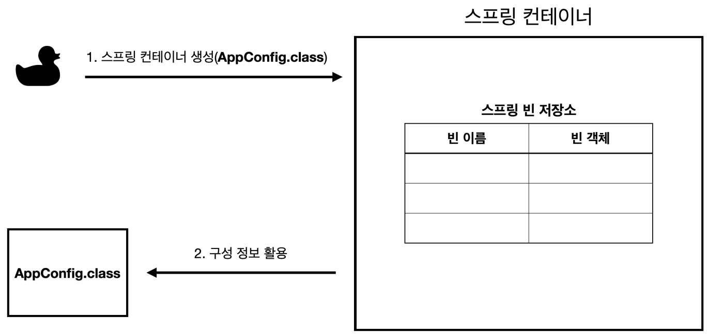
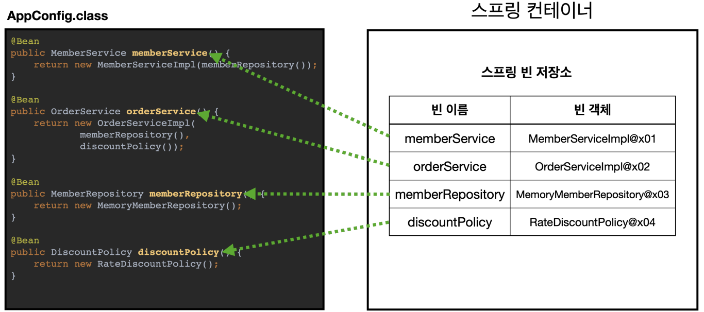
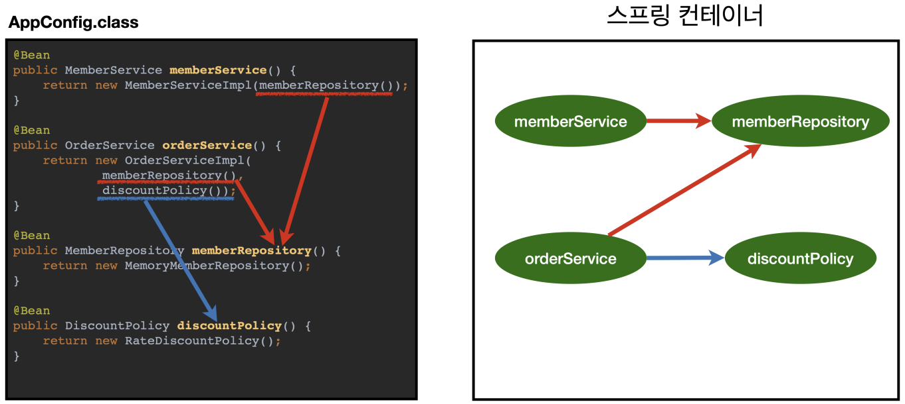

<br />

## Spring Container 생성

1. Spring Container 생성

   

   - new AnnotationConfigApplicationContext(AppConfig.class)로 Spring Container 생성
   - 구성 정보 지정 (AppConfig.class)

<p></p>

2. Spring Bean 등록

   

   - 파라미터로 넘어온 설정 클래스 정보를 사용해서 Spring Bean을 등록
   - Bean 이름은 메서드 이름을 사용
   - Bean 이름을 직접 부여할 수 있음

     ex. @Bean(name="memberService")

   - Bean 이름은 항상 다른 이름을 부여해야 함

<p></p>

3. Spring Bean의 의존관계 설정

   

   - Spring Container는 설정 정보를 참고해서 의존관계 주입(DI)

<br />

## Spring Bean 조회

```java
ApplicationContext applicationContext = new AnnotationConfigApplicationContext(AppConfig.class);        // Spring Container 생성
String[] beanDefinitionNames          = applicationContext.getBeanDefinitionNames();                    // Bean Name 리스트 반환
BeanDefinition beanDefinition         = applicationContext.getBeanDefinition(beanDefinitionName);       // Bean 설정값 반환
int role                              = beanDefinition.getRole();                                       // ROLE_APPLICATION(직접 등록한 애플리케이션 빈), ROLE_INFRASTRUCTURE (스프링이 내부에서 사용하는 빈)
Object bean                           = applicationContext.getBean(BeanType.class);                     // Bean 반환
BeanType bean                         = applicationContext.getBean(beanDefinitionName, BeanType.class); // Bean 반환
Map<String, BeanType> beansOfType     = applicationContext.getBeansOfType(BeanType.class);              // (Bean Name, Bean Type) 반환
```

<br />

## 사용 예제

```java
// AppConfig.java

@Configuration // Spring Container은 @Configuration이 붙은 클래스를 설정(구성) 정보로 사용
public class AppConfig {

    @Bean // @Bean이라 적힌 메서드를 모두 호출해서 반환된 객체를 스프링 컨테이너에 등록
    public MemberService memberService(){
        return new MemberServiceImpl(memberRepository());
    }

    @Bean
    public MemoryMemberRepository memberRepository() {
        return new MemoryMemberRepository();
    }

    ...
}
```

```java
// MemberServiceImpl.java

public class MemberServiceImpl implements MemberService {

    private final MemberRepository memberRepository;

    public MemberServiceImpl(MemberRepository memberRepository) {
        this.memberRepository = memberRepository;
    }

    ...
}
```

```java
// MemberApp.java

public class MemberApp {

    public static void main(String[] args) {
        ApplicationContext applicationContext = new AnnotationConfigApplicationContext(AppConfig.class); // Spring Container 생성
        MemberService memberService = applicationContext.getBean("memberService", MemberService.class); // Spring Bean 찾기

				...
    }
}
```

<br />
<br />
<br />

[출처: 김영한, 「스프링 핵심 원리 - 기본편」, 인프런](https://www.inflearn.com/course/%EC%8A%A4%ED%94%84%EB%A7%81-%ED%95%B5%EC%8B%AC-%EC%9B%90%EB%A6%AC-%EA%B8%B0%EB%B3%B8%ED%8E%B8)

<br />
